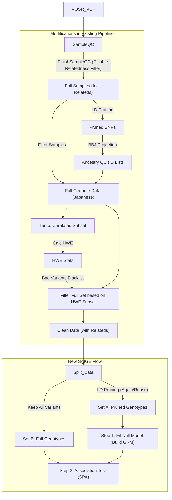

# Detailed Comparison of PLINK2 --glm and SAIGE for Binary Trait Association Analysis

This document details the specific differences between PLINK2's `--glm` module and SAIGE (Scalable and Accurate Implementation of GEneralized mixed model) in terms of statistical principles, model construction, and applicable scenarios for binary variables (such as CTEPH vs Healthy in this study).

## 1. PLINK2 `--glm` (Generalized Linear Model)

PLINK2's `--glm` stands for Generalized Linear Model. For binary traits (Case/Control), it effectively performs **Logistic Regression**.

### 1.1 Statistical Model
For the $j$-th individual, let $Y_j$ be the phenotype (1=Case, 0=Control), $g_j$ be the genotype of the target variant (usually a dosage value of 0, 1, 2), and $\mathbf{X}_j$ be the vector of covariates (e.g., age, sex, PCs).

The model takes the form of Logistic Regression:

$$
\text{logit}(P(Y_j=1)) = \ln\left(\frac{P(Y_j=1)}{1-P(Y_j=1)}\right) = \beta_0 + g_j \beta + \mathbf{X}_j^T \boldsymbol{\alpha}
$$

**Variable Details**:
*   $j$: Individual index ($j = 1, \dots, N$).
*   $Y_j$: Binary phenotype status of the $j$-th individual (Case=1, Control=0).
*   $P(Y_j=1)$: Probability of the individual being a Case.
*   $\beta_0$: **Intercept**, representing the baseline log-odds when all independent variables are 0.
*   $g_j$: **Genotype Dosage** of the $j$-th individual at the target site, values are typically 0, 1, 2 (additive model).
*   $\beta$: **Target Genetic Effect Size**, which is the target parameter we need to test. Its exponential form $e^{\beta}$ is the Odds Ratio (OR).
*   $\mathbf{X}_j$: **Covariate Vector** for the $j$-th individual, with dimensions $K \times 1$.
*   $\boldsymbol{\alpha}$: **Covariate Coefficients** vector, with dimensions $K \times 1$, representing fixed effects of age, sex, PCs, etc., on disease risk.

*   **Hypothesis Testing**: Tests the null hypothesis $H_0: \beta = 0$. PLINK2 defaults to using the Wald Test or Score Test.

### 1.2 Handling Population Structure and Relatedness
*   **Fixed Effects**: PLINK2 `--glm` treats population stratification as fixed effects, correcting for it via Principal Components (PCs) in $\mathbf{X}_j$.
*   **Limitations**: This method is mainly applicable to **Unrelated** samples. If family structures or Cryptic Relatedness exist in the sample, using PCs alone may not fully correct for them, leading to inflation of the Type I error rate (increased false positives).

### 1.3 Handling Imbalanced Data (Firth Regression)
*   When cases are few or allele frequencies are extremely low in binary traits, the maximum likelihood estimation of standard logistic regression may fail to converge or be biased.
*   PLINK2 implements **Firth Bias-Corrected Regression** (penalized likelihood estimation). When low counts are detected, it automatically applies Firth regression to provide more robust P-values and effect estimates.

---

## 2. SAIGE (Generalized Linear Mixed Model)

SAIGE is designed specifically for large-scale biobanks to address **sample relatedness** and **extremely imbalanced Case-Control ratios**.

### 2.1 Statistical Model
SAIGE uses a **Generalized Linear Mixed Model (GLMM)**. All symbol definitions remain consistent with the GLM above, but a key **Random Effect term** is added.

$$
\text{logit}(P(Y_j=1)) = \beta_0 + g_j \beta + \mathbf{X}_j^T \boldsymbol{\alpha} + b_j
$$

**New Variable Details**:
*   $b_j$: **Random Effect** for the $j$-th individual. It represents susceptibility differences caused by genetic relationships between individuals, beyond known covariates.
*   Distribution Assumption: The random effect vector for all samples $\mathbf{b} = (b_1, \dots, b_N)^T$ follows a multivariate normal distribution:
    $$
    \mathbf{b} \sim N(\mathbf{0}, \tau \mathbf{K})
    $$
*   $\tau$: **Genetic Variance Component**. It is a scalar measuring the contribution of the genome-wide genetic background to phenotypic variation.
*   $\mathbf{K}$: **Genetic Relationship Matrix (GRM)**, dimensions $N \times N$.
    *   **Core Role**: This matrix acts like a huge "network of relationships," clearly quantifying all possible genetic connections between samples (including known kinship and unknown substructures).
    *   **Correction Mechanism**: When testing if a specific SNP is associated with the disease, GLMM is essentially asking: "**After deducting phenotypic similarities caused by genome-wide background similarities (relatedness, population structure) explained by the GRM**, is this SNP still significant?"
    *   **Calculation Formula**: The genetic correlation $K_{ij}$ between individual $i$ and individual $j$ is calculated as follows (Standardized GRM):
        $$
        K_{ij} = \frac{1}{M} \sum_{m=1}^{M} \frac{(g_{im} - 2p_m)(g_{jm} - 2p_m)}{2p_m(1-p_m)}
        $$
        Where:
        *   $M$: Total number of SNPs used to construct the GRM (tens of thousands of Pruned SNPs).
        *   $g_{im}, g_{jm}$: Genotype dosages of individuals $i$ and $j$ at the $m$-th SNP (0, 1, 2).
        *   $p_m$: Minor Allele Frequency (MAF) of the $m$-th SNP.
    *   **Matrix Structure Interpretation**:
        *   **Diagonal Elements ($K_{ii}$)**: Represent the individual's inbreeding coefficient (Self-relatedness). Usually around 1 (if no inbreeding).
        *   **Off-diagonal Elements ($K_{ij}$)**: Quantify the relatedness between two people.
            *   If $i$ and $j$ are unrelated: value approaches 0.
            *   If $i$ and $j$ are siblings/parent-child: value approaches 0.5.
            *   If $i$ and $j$ are cousins: value approaches 0.125.

### 2.2 Two-Step Approach
To improve computational efficiency, SAIGE does not fit a full GLMM for every variant site. Instead, it uses a two-step approach:

1.  **Step 1 (Fitting the Null Model) & LOCO Strategy**:
    *   **Goal**: Estimate the variance component $\tau$ and fixed effect coefficients of covariates in the model first, even without a specific genetic variant $g_j$.
    *   **LOCO (Leave-One-Chromosome-Out) Details**:
        *   **Why do this? (Proximal Contamination)**: The mixed model assumes random effects represent "residual polygenic background". If the SNP we are testing (e.g., on Chr 1) is itself included in the SNP list used to build the GRM, its effect will be erroneously absorbed into the random effect (background noise), leading to a significantly weakened signal when testing the SNP's own fixed effect (reduced statistical power). This is called **Proximal Contamination**.
        *   **How does SAIGE implement this?**:
            *   SAIGE does not just fit one "universal" Null Model. Instead, it uses the LOCO strategy to iterate through all autosomes.
            *   When analyzing variants on **Chromosome $i$** (e.g., Chr 1), SAIGE uses a GRM constructed from SNPs on **all other chromosomes except Chromosome $i$** (Chr 2-22), denoted as $\mathbf{K}_{-i}$.
            *   Based on this $\mathbf{K}_{-i}$, SAIGE calculates a set of model parameters specifically for analyzing Chr 1 (including variance component $\tau_{-i}$ and corresponding residuals).
        *   **Result**: The model file (`.rda`) generated by SAIGE Step 1 actually contains 22 sets of independent model parameters (for 22 autosomes). When analyzing variants on Chr 1 in Step 2, the program automatically calls the parameter set that excluded Chr 1, thus thoroughly eliminating proximal contamination.
    *   **Mathematical Model (Null Model)**:
        Since Step 1 does not need to consider the effect of a specific candidate SNP (i.e., assuming $\beta=0$), the model simplifies to:
        $$
        \text{logit}(\mu_j) = \beta_0 + \mathbf{X}_j^T \boldsymbol{\alpha} + b_j^{(-i)}
        $$
        **Variable Details**:
        *   $\mu_j = P(Y_j=1 | \mathbf{X}_j, b_j)$: Probability of disease given covariates and random effects.
        *   $\beta_0, \boldsymbol{\alpha}$: Fixed effect parameters to be estimated for the null model (intercept and covariate coefficients).
        *   $b_j^{(-i)}$: **Random effect adjusted by LOCO strategy**. It follows $N(\mathbf{0}, \tau \mathbf{K}_{-i})$, where $\mathbf{K}_{-i}$ is the GRM constructed after removing all markers on chromosome $i$.
        *   **Output**: The main outputs of this step are the estimated random variance $\hat{\tau}$, fixed effect coefficients $\hat{\beta_0}, \hat{\boldsymbol{\alpha}}$, and the predicted probability $\hat{\mu}_j$ for each individual.

2.  **Step 2 (Association Test)**:
    *   **Core Task**: To test whether Genotype $g$ is significantly associated with the phenotype for every variant site genome-wide (even low-frequency variants).
    *   **Mathematical Model (Full Model for Genotype $g$)**:
        $$
        \text{logit}(\mu_j) = \beta_0 + g_{j} \beta + \mathbf{X}_j^T \boldsymbol{\alpha} + b_j
        $$
        *   Compared to the Null Model in Step 1, this adds a **$g_j \beta$** term.
        *   $g_j$: Genotype dosage of the SNP currently being tested.
        *   $\beta$: Effect size (Log OR) of the SNP.
        *   **Hypothesis Testing Goal**: Test the null hypothesis $H_0: \beta = 0$.
    *   **Choice of Statistical Method: Score Test vs Wald Test**:
        *   **Wald Test (PLINK2 / Standard GLM)**: Requires fitting a full regression model (including SNP effect) separately for **every SNP**. This means if there are 10 million SNPs, 10 million iterative regression calculations are needed, which is computationally extremely expensive.
        *   **Score Test (SAIGE)**: Relies only on the parameters of the **Null Model** (calculated in Step 1). It evaluates whether adding the SNP significantly improves model fit by calculating the first derivative (Score) of the log-likelihood function at $\beta_g=0$.
            *   **Score Statistic Formula**:
                $$
                T = \sum_{j=1}^N g_j (Y_j - \hat{\mu}_j)
                $$
                *   $g_j$: Genotype dosage (0, 1, 2).
                *   $Y_j - \hat{\mu}_j$: Residual under the null model (Actual disease status - Model predicted probability).
                *   **Intuitive Understanding**: The statistic $T$ is essentially the **dot product of genotype and residual**. If an SNP is positively associated with the disease, then in people where $Y_j=1$ (Case) and the residual is large (model prediction is poor), we should also observe more $g_j$ (e.g., = 2). The sum of their products $T$ will significantly deviate from 0.
        *   **Advantage**: The Score Test **greatly improves computation speed**. Because it does not need to perform heavy model fitting for tens of millions of variants one by one, but directly uses the background parameters calculated in Step 1 to quickly calculate statistics. This makes running complex mixed models on a genome-wide scale possible.

### 2.3 Core Advantage: Saddlepoint Approximation (SPA)

This is SAIGE's core "killer feature" distinguishing it from traditional mixed models (like GMMAT), specifically solving the problem of **extremely imbalanced Case-Control ratios**.

#### 2.3.1 Why traditional Tests fail? (Collapse of the Normal Distribution Assumption)
*   **Ideal Scenario (Many Cases)**: According to the Central Limit Theorem, statistical test quantities usually follow a **Normal Distribution** (standard bell curve). As long as your statistic falls on the ends (tails) of the bell curve, it counts as significant.
*   **Realistic Dilemma (Few Cases + Rare Variants)**:
    *   Imagine if you have 10,000 healthy people but only 50 patients.
    *   At this time, for a rare variant carried by only 3 people, its statistical distribution is no longer a symmetric bell shape but is **Highly Skewed**.
    *   **Consequence**: If you still force the "Normal Distribution" ruler to measure this skewed distribution, you will severely underestimate the P-value (e.g., a signal that is originally P=0.01 and not significant might be calculated as P=1e-5), leading to a large number of **False Positives**.

#### 2.3.2 How does SPA save the day? (From "Guessing Shape" to "Calculating Shape")

The core of SPA is that it no longer relies on the "Normal Distribution" as a universal template, but uses mathematical tools to directly **reconstruct** the true shape of the statistic and its tail probability.

**What exactly does it do? (Three Steps)**

1.  **Get the "Gene" (CGF)**:
    *   Although the final distribution of the Score statistic $T$ looks very skewed (unknown and complex), every component of it (the contribution of each individual) is known.
    *   SPA uses this known information to construct the **Cumulant Generating Function (CGF)** of the statistic $T$, denoted as $K(t)$.
    *   *Plain English*: CGF is like the DNA of a distribution; it contains all the information about this twisted distribution (not just mean and variance, but also skewness, kurtosis, and all higher-order moments).

2.  **Find the "Saddlepoint" (Solving Saddlepoint)**:
    *   For every observed Score value $q$, SPA finds a special parameter $\zeta$ by solving the equation $K'(\zeta) = q$, and this point is called the **Saddlepoint**.
    *   *Plain English*: This step is equivalent to finding a key observational pivot point on a complex probability surface.

3.  **Precision Strike (Calculated Approximation)**:
    *   Using the found saddlepoint $\zeta$ and CGF function $K(t)$, SPA substitutes them into the famous **Lugannani-Rice formula**:
        $$
        P \approx 1 - \Phi(w) + \phi(w) \left( \frac{1}{u} - \frac{1}{w} \right)
        $$
        **Variable Details**:
        *   $P$: Corrected tail P-value.
        *   $\Phi(\cdot)$: **Cumulative Distribution Function (CDF)** of the standard normal distribution.
        *   $\phi(\cdot)$: **Probability Density Function (PDF)** of the standard normal distribution.
        *   $w$: **Transformed form of likelihood ratio statistic**, calculated as $w = \text{sign}(\zeta)\sqrt{2(\zeta q - K(\zeta))}$. It captures the main shift of the distribution.
        *   $u$: **Adjustment factor**, calculated as $u = \zeta \sqrt{K''(\zeta)}$. It uses the second derivative of the CGF (variance information) to correct for local curvature.
        *   $\zeta$: **Saddlepoint**, the solution to $K'(\zeta) = q$.
        *   $q$: Actually observed Score statistic.

    *   *Plain English*: This is a mathematical "magic formula". It doesn't need to perform complex integration (calculating area) like traditional methods, but can calculate tail probability (P-value) extremely precisely through simple algebraic operations. And the more extreme it is (further in the tail), the more accurate this formula becomes.

**Summary Comparison**:
*   **Traditional Method (Normal Approx)**: Uses only the **first two moments** (mean and variance). It naively assumes that as long as size and width are known, all distributions are bell curves. —— **Blind Confidence**.
*   **SPA Method**: Uses **all moments** (via CGF). It draws every curved detail of the distribution according to the real data situation. —— **Seeking Truth from Facts**.

#### 2.3.3 A Concrete Case of False Positive Disaster
To let you thoroughly understand the power of SPA, let's look at an **extreme but real** scenario:

*   **Scenario Setup**:
    *   **Sample**: 10,000 Healthy People (Controls) + **100 Patients (Cases)**. (Case ratio ≈ 1%)
    *   **Variant**: A rare variant `rs999`, appearing in only **3 people** in total.
    *   **Observed Data**: Among these 3 carriers, exactly **1 is a Case**, and 2 are Controls.

*   **Intuitive Judgment**:
    *   Although Cases are only 1%, 33% (1/3) of carriers are Cases. This looks like a strong enrichment signal, right?

*   **Judgment by Traditional Method (Score Test w/o SPA)**:
    *   **How is the Z-score calculated? (Simple Derivation)**:
        *   **Formula Intent**:
            $$
            Z \approx \frac{S - E[S]}{\sqrt{\text{Var}(S)}}
            $$
            Where $S$ is the observed statistic (e.g., total number of variant alleles in Cases), $E[S]$ is the expected value under the null hypothesis, and $\text{Var}(S)$ is the variance.
        *   **Calculate Expectation**: The population carrier rate is $3/10100 \approx 0.0003$. So among 100 Cases, by random assignment, there should theoretically be only $100 \times 0.0003 = \mathbf{0.03}$ people carrying it.
        *   **Look at Observation**: Actually observed **1** person carrying ($S=1$).
        *   **Calculate Deviation**: More than expected by $1 - 0.03 = 0.97$.
        *   **Conclusion**: Because the variant is too rare, the standard deviation (denominator) is usually extremely small (e.g., $\sqrt{\text{Var}(S)} \approx 0.2$). When you divide $0.97$ by a very small number, you get a huge Z value ($0.97 / 0.2 \approx 4.85 \approx 5.0$).
    *   **Check Table for P**: Traditional methods assume Z follows a **Normal Distribution**. Checking the normal distribution table, the probability of Z=5.0 occurring is negligible, giving **P ≈ 2.8 × 10⁻⁷**.
    *   **Root of Error**: In this discrete low-probability event of "catching only 1 person in 100 Cases", **the Z-score does not follow a normal distribution at all**. The normal distribution table fails here; it overly exaggerates the rarity of this Z=5.0.
    *   **Consequence**: Reached genome-wide significance level (magnitude of 5 × 10⁻⁸)! **You think you found a pathogenic locus!**

*   **Judgment by SAIGE SPA (Restoring True Probability)**:
    *   **Step 1: Construct CGF containing "Discreteness"**:
        *   SPA captures the essence of the data through CGF function $K(t)$: this statistic is contributed by **only 3 carriers**.
        *   CGF contains information about this **high discreteness** and **extreme skewness**. It "knows" that statistic $T$ cannot take just any value; it is essentially more like a trial of tossing 3 coins (binomial distribution logic) rather than a continuous bell curve.
    *   **Step 2: Saddlepoint Location**:
        *   For the observed $T \approx 0.97$ (corresponding to 1 Case carrier), SPA solves equation $K'(\zeta) = 0.97$ to find the saddlepoint. This step determines exactly where we are on the long tail of the distribution.
    *   **Step 3: Probability Correction (Lugannani-Rice)**:
        *   After substituting into the formula, SPA finds: In the background of only 1% prevalence in the total population, 1 out of 3 carriers being a Case is a small probability event, but **definitely not** a miracle like "once in tens of millions of years" predicted by the normal distribution ($10^{-7}$).
        *   The probability it gives is closer to a simple binomial distribution estimate ($1 - 0.99^3 \approx 0.03$).
    *   **Final Result**:
        *   The SPA corrected P-value might be **P ≈ 1.0 × 10⁻³** or **0.03** (depending on specific covariates).
        *   **Conclusion**: Not significant at all. **SPA successfully exposed this false positive and beat a signal praised as a "major discovery" by traditional methods back to its original form (random fluctuation).**

This is why SAIGE dares to claim it can handle Case:Control = 1:100 or even more disparate ratios without generating massive false signals.

---

## 3. Summary Comparison

| Feature | PLINK2 `--glm` | SAIGE |
| :--- | :--- | :--- |
| **Model Basis** | Generalized Linear Model (GLM) <br> *Logistic Regression* | Generalized Linear Mixed Model (GLMM) <br> *Logistic Mixed Model* |
| **Relatedness Handling** | Only via Covariates (PCs) <br> *Cannot handle complex family structures* | Via GRM (Random Effects) <br> *Built from genome-wide data, handles close relatives/families* |
| **Imbalanced Samples (Case << Control)** | Uses Firth Regression to correct bias | Uses **SPA (Saddlepoint Approximation)** to correct P-value distribution |
| **Applicable Scenarios** | Common variants, unrelated samples, balanced Case/Control ratio | Rare variants, samples with relatedness, **extremely imbalanced Case/Control** |
| **Computational Speed** | Extremely fast | Slower (Step 1 building GRM is time-consuming, but Step 2 is faster) |
| **P-value Accuracy** | May inflate with imbalanced data or rare variants | Remains robust under extreme imbalance and rare variants |

### 4. Recommendations for This Study (CTEPH vs Healthy)

If the sample size of CTEPH is very small relative to Healthy Controls (highly imbalanced), or if the sample may contain unknown relatedness:

1.  **SAIGE** is the theoretically more rigorous choice because it considers correlation through GRM and corrects P-value bias caused by imbalance through SPA.
2.  **PLINK2** can serve as a tool for quick screening or validation in large samples with common variants. If using PLINK2, it is recommended to enable the Firth regression option and strictly perform PCA correction.

---

## 5. Detailed Explanations on SAIGE Applicability for Related Samples and Complex Genetic Structures

### 5.1 Can related samples and samples with different population structures be included?
**Yes, but distinctions are needed.**

One of SAIGE's design intentions is to solve complex sample structures that cannot be fully corrected by PCs alone.

1.  **Related Samples**:
    *   **Absolutely**. This is SAIGE's strength. Whether it is family data or cryptic relatedness in the population, GRM can model and correct it well without exclusion.

2.  **Simultaneous Inclusion of Different Population Structures**:
    *   **Sub-structures**: For example, mixtures of Japanese, Honshu, and Ryukyu people, or minor regional structures. **Absolutely**. SAIGE's GRM combined with Principal Components (PCs) can very effectively correct for this level of stratification and prevent false positives.
    *   **Cross-Ethnicity (e.g., Asian + European)**:
        *   **Technically feasible**: SAIGE's mathematical model (GLMM) has the capability to absorb this huge genetic background difference through GRM, thereby controlling Type I error (false positives).
        *   **Analysis Strategy Suggestion**: Although SAIGE can control false positives, mixing groups with huge genetic background differences (e.g., 50% European + 50% East Asian) may introduce **Heterogeneity** problems (i.e., the effect size of the same variant differs across races).
        *   It is usually recommended to prioritize **Stratified Analysis** followed by **Meta-analysis**.
        *   However, if the sample size is small (like CTEPH), to maximize statistical power, **different groups can be combined for analysis**, but be sure to:
            1.  **Construct GRM accurately** (using genome-wide Pruned SNPs).
            2.  **Must include sufficient top PCs** (e.g., PC1-PC10) as fixed effect covariates to maximally capture macro-level racial differences.

**Conclusion**: For this study (mainly structure within Japanese population), it is **possible and recommended** to include all samples simultaneously, utilizing SAIGE to significantly correct for population stratification.

### 5.2 Since we have GRM, does SAIGE still need Principal Components (PCs) as covariates?

**Recommended to keep.**

Although SAIGE's mixed model handles major population structure and relatedness through GRM, in practice, **it is still strongly recommended to include the top few principal components (e.g., PC1-PC5 or PC1-PC10)** as Fixed Effect Covariates in the Step 1 model.

**Reasons are as follows:**
1.  **Capturing Different Levels of Structure**:
    *   **GRM (Random Effects)** excels at treating closer relatedness and fine local structure.
    *   **PCs (Fixed Effects)** excel at treating **macro population stratification** at the genome-wide level (i.e., Global Ancestry, such as clear racial differences or large geographic subgroup differences).
2.  **Computational Efficiency**: Removing large population structures through PCs as fixed effects allows the random effect term in the mixed model to focus more on handling remaining fine structures and relatedness, aiding model convergence.
3.  **Double Safeguard**: Many literatures and SAIGE's official recommended practices point out that using both GRM and PCs simultaneously provides the best control over population stratification and ensures result robustness.

**Conclusion**: When running SAIGE, please continue to include calculated PCs (usually top 5-20) in the `covarFile`.

---

## 6. Adjustments to Sample Filtering Process Based on SAIGE (GLMM) Strategy

**Summary of Core Changes:** The screening criteria shift from traditional "Relatedness Filtering" to looser but more precise "Ancestry QC".

### 6.1 Steps to Retain: Ancestry QC
*   **Purpose**: Ensure consistency in macro genetic background for all samples included in the analysis (e.g., all East Asian/Japanese ancestry), excluding obvious ethnic outliers.
*   **Necessity**:
    *   **Prevent Stratification Interference**: If the sample mixes completely different races (e.g., non-East Asian), this drastic genetic background difference (Population Stratification) will severely reduce GLMM fitting efficiency or even lead to significant loss of statistical power.
    *   **Outlier Identification**: BBJ-Projection is the best means to identify abnormal samples (including racial mismatch or severe sequencing quality issues).
    *   **Operational Suggestion**: Continue to execute BBJ-Projection and exclude outlier samples that significantly deviate from the core Japanese cluster on the PC1/PC2 projection plot.

### 6.2 Steps to Remove: Relatedness Filtering
*   **Traditional PLINK Process**: Usually requires using `king-cutoff` (e.g., 0.177) or `pi-hat` (e.g., 0.2) thresholds to exclude family members, ensuring only one individual per family is kept (Unrelated Set).
*   **SAIGE Process**: **No longer needed**.
*   **Basis**: SAIGE's core strength is utilizing GRM (Genetic Relationship Matrix) to incorporate relatedness between samples as random effects into the model. Retaining related samples not only introduces no bias but increases sample size, boosting statistical power for detecting rare variants.

### 6.3 Core Question: Will retaining related samples interfere with the accuracy of BBJ-Projection (PCA)?

This is a critical methodological question. The answer depends on how PCA is constructed: Is it **Projection PCA** based on an external reference set, or **In-house PCA** based on own data recalculation?

#### 6.3.1 Scenario 1: Projection onto BBJ Reference Set (Projection PCA) —— **Mode Adopted by This Study**
**Conclusion: Does not affect accuracy at all, safe and feasible.**

In "BBJ Projection" mode, the PCA process is split into "Definition" and "Application" steps:
1.  **Map Construction**: PCA principal components (Eigenvectors/Axes) are calculated entirely based on the independent and strictly quality-controlled **BBJ Reference Dataset**. This is equivalent to drawing a standard "genetic map".
2.  **Sample Projection**: This step only "projects" CTEPH samples (whether relatedness implies or not) onto this unchanged map.

**Principle Analysis: Independence of Coordinate System**
*   **Fixed Axes**: The coordinate axes (scoring formulas) are determined by BBJ data and are completely unaffected by the internal structure (including relatedness) of CTEPH samples.
*   **True Reflection**: If relatedness exists in samples (e.g., a pair of brothers), their coordinates in PC space will naturally cluster together after projection. This objectively reflects their genetic similarity, and this information is exactly what SAIGE needs for modeling via GRM later.

**Verification of Existing Pipeline (`wgs/select.nf`)**
Our workflow logic strictly follows the above mode:
1.  **Definition Phase**: In the `prepare_bbj_pca_inputs` step, we run `plink2 --pca allele-wts` using only **BBJ data**. The generated `*.eigenvec.allele` file (allele weights) is the fixed "map standard".
2.  **Projection Phase**: In the `run_bbj_projection` step, we execute `plink2 --score ... read-freq ...` on CTEPH samples using the above weight file. This means we are not recalculating PCA principal components, but directly calculating sample positions in the established coordinate system.

**【Case Demo: Stability of Projection Mechanism】**
For intuitive understanding, we can compare PCA projection to a **"Standardized Exam"**:

1.  **Setting Standards (BBJ)**:
    The exam board analyzed thousands of unrelated BBJ samples and established a scoring standard (Principal Components), e.g.:
    *   `PC1 Score = 0.35 * rs123_Count + 0.12 * rs456_Count + ...`
    *   Once this formula (corresponding to `*.eigenvec.allele`) is released, it is **fixed and immutable** as a standard.

2.  **Taking the Exam (CTEPH)**:
    Now a pair of **biological brothers (Brother A & Brother B)** in the CTEPH cohort enter to take the exam. We directly apply the above fixed formula to score them:
    *   Since their genotypes are highly similar, their calculated `PC1` scores must be extremely close.
    *   **Result**: Their rankings on the report card (PC Plot) are right next to each other.
    *   **Core Logic**: The brothers' participation merely adds two close data points to the report card, **having absolutely no ability to modify the already fixed scoring formula**. The exam standard (map) remains objective and neutral, and will not be "distorted" by the addition of this group of related samples.

Therefore, under Projection mode, retaining related samples is absolutely safe.

#### 6.3.2 Scenario 2: In-house PCA Based Only on Internal Samples —— **Risk to Watch Out For**
**Conclusion: Severe bias will occur (if not pre-processed).**

If you run `plink2 --pca` directly on these few hundred CTEPH samples without BBJ projection:
*   **Risk Mechanism**: PCA algorithms aim to maximize data variance. If the sample contains significant kinship clusters (e.g., a large family), PCA often captures this strong family difference first, causing the top Principal Components (Top PCs) to become "Family Components" rather than the expected "Population Structure Components".
*   **Consequence**: PC1/PC2 will separate this family from other samples, instead of distinguishing true geographic/racial subgroups, leading to correction failure.

**Correct Operation Workflow (If In-house PCA is Necessary)**:
1.  **Pre-screening**: First exclude related samples to build an **Unrelated Set**.
2.  **Define Coordinates**: Calculate PCA Eigenvectors (build coordinate system) using only this Unrelated Set.
3.  **Back-projection**: **Project** remaining Related Samples back into this coordinate system defined by unrelated individuals (can use PLINK2's `--pca-allelic-frame` parameter).

### 6.4 Summary Recommendation
Given that your Pipeline has correctly implemented the **BBJ Projection** strategy, you can confidently **retain all QC-passed related samples** during the sample screening phase. This will not only not destroy PCA accuracy but will maximize the use of SAIGE's model advantages.

---

## 7. SAIGE Migration Scheme Based on Existing Pipeline (`wgs/select.nf`)

For your current Nextflow workflow (`select.nf`), converting from PLINK2 to SAIGE requires parameter adjustments and new Processes for specific modules. Below is the detailed design scheme:

### 8.1 Logical Changes in Key Nodes

#### 1. Sample QC Stage (Step 11: `RunSampleQC` & `FinishSampleQC`)
*   **Original Logic**: `RunSampleQC` generates Pi-hat (IBD) stats, `FinishSampleQC` usually applies a threshold (e.g., 0.2) to exclude closely related samples, keeping an Unrelated Set.
*   **SAIGE Adaptation**:
    *   **Action**: Modify the call parameters of `FinishSampleQC` (or its internal Python script `sample_qc_pipeline.py`).
    *   **Goal**: **Disable** sample exclusion based on Pi-hat.
    *   **Result**: The output PLINK file should contain all samples passing Call Rate/Heterozygosity checks, **including relatives (Relateds)**.

#### 2. Population Screening (BBJ Projection Steps)
*   **Unchanged**: `RunBBJPCA` -> `RunBBJProjection` -> `BBJSampleKeep`.
*   **Special Note (LD Pruning)**: **BBJ Projection must use LD Pruned variants set**.
    *   Although we formally split Set A (Pruned Set for SAIGE model) downstream, when performing projection calculation here, the input data must also undergo the same LD Pruning (or directly use an early version of Set A).
    *   **Reason**: BBJ's reference PCA space consists of Pruned SNPs; the projection input variant set must be consistent with the reference set.
*   **Logic**: Continue to use BBJ projection results to identify outliers of non-East Asian/non-Japanese ancestry. Even if relatedness exists in samples, projection is accurate. The final "Keep List" will be applied to **Full Variants**.

#### 3. Variant QC (Step 13: `RunVariantQC`)
*   **Adjustment Need**: You want to exclude the influence of related samples when calculating HWE to get more accurate QC metrics, but retain related samples in the final analysis.
*   **Recommended Solution (Subset-based HWE)**:
    1.  **Temp Subset**: Temporarily generate an `Unrelated_Subset` (using `king-cutoff` or `pi-hat` to exclude relatives) inside or before `RunVariantQC`.
    2.  **Calc HWE**: Calculate HWE P-value only on this `Unrelated_Subset`.
    3.  **Apply Filter**: Record variant IDs that do not meet HWE thresholds.
    4.  **Backtrack Cleaning**: Use this "Bad Variant Blacklist" to clean the **Full Sample Set (Full Set with Relateds)**.
*   **Result**: This ensures rigor of HWE statistics (unaffected by kinship structure) while maximizing sample size in the final SAIGE analysis.

### 8.2 Data Splitting Design (Prepare Inputs for SAIGE)

After completing the above QC, the flow needs to branch here to prepare two sets of data:

#### Input Set A: For SAIGE Step 1 (Fitting Null Model)
*   **Requirement**: Must be **LD Pruned** autosomal variants.
*   **Source**: Utilize byproduct of **Step 14 `RunPCA`**.
    *   `RunPCA` generates `*.prune.in` file.
    *   Use `plink2 --extract *.prune.in` to extract variants from `Clean_Data_With_Relateds`.
*   **Purpose**: Construct high-precision GRM (Genetic Relationship Matrix).

#### Input Set B: For SAIGE Step 2 (Association Test)
*   **Requirement**: Genome-wide all QC-passed variants (including Rare Variants).
*   **Source**: Directly use output of **Step 13 `RunVariantQC`** (`Clean_Data_With_Relateds`).
*   **Purpose**: Perform association test site by site.

### 8.3 New Process Design

You need to write two new Nextflow processes to interface with SAIGE:

```groovy
// Pseudo-code Example

// 1. Fit Null Model (High computation, large memory need)
process SAIGE_Step1_FitNullModel {
    input:
    tuple file(bed), file(bim), file(fam) from pruned_data_ch // Input Set A
    file pheno_file
    file covar_file // Must include BBJ-Projection PCs (PC1-PC5) + Age + Sex

    output:
    file "metrics/model_file.rda" into saige_model_ch
    file "metrics/varianceRatio.txt"

    script:
    """
    Rscript step1_fitNULLGLMM.R \
        --plinkFile=... \
        --phenoFile=${pheno_file} \
        --covarFile=${covar_file} \
        --traitType=binary \
        --outputPrefix=./metrics/ \
        --nThreads=32 \
        --IsOverwriteVarianceRatioFile=TRUE
    """
}

// 2. Genome-wide Association Test (Highly parallelized, run by chromosome)
process SAIGE_Step2_Association {
    tag "chr${chr}"
    
    input:
    file model_file from saige_model_ch
    tuple chr, file(vcf), file(tbi) from clean_full_vcf_ch // Input Set B (Recommend VCF i.e. data before upstream vcf2bed, or convert back to PLINK)
    
    output:
    file "*.SAIGE.gwas.txt"

    script:
    """
    Rscript step2_SPAtests.R \
        --vcfFile=${vcf} \
        --modelFile=${model_file} \
        --chrom=${chr} \
        --minMAF=0 \
        --minMAC=1 \
        --GMMATmodelFile=${model_file} \
        --varianceRatioFile=${model_file.parent}/varianceRatio.txt
    """
}
```

### 8.4 Summary Flowchart


