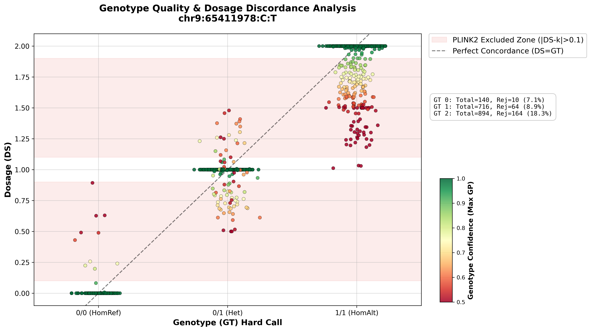

# Understanding False Positives in Minimac4 Imputation
## The Mechanism of Discordance between Hard Calls (GT) and Dosage (DS)

### Observation
In our analysis of imputed variants, we observed instances where the Hard Call Genotype (GT) did not match the Dosage (DS). For example, a sample might have a GT of `0/1` (heterozygous) but a DS of `0.4` (indicating a higher probability of being reference homozygous `0/0`).

### The Cause: Minimac4 Calling Strategy
Minimac4 (and similar imputation tools) generates Genotype Probabilities (GP) for the three possible genotypes: 
- $P(0/0)$
- $P(0/1)$
- $P(1/1)$

#### Hard Calling (GT)
The Hard Call (GT) is determined by simply taking the genotype with the **maximum probability**, regardless of how high that probability is. 

$$ GT = \text{argmax}(P(0/0), P(0/1), P(1/1)) $$

If the probabilities are:
- $P(0/0) = 0.30$
- $P(0/1) = 0.40$
- $P(1/1) = 0.30$

Minimac4 assigns **GT = 0/1** because 0.40 > 0.30.

#### Dosage Calculation (DS)
Dosage (DS) is the **expected number of alternate alleles**, calculated as a weighted sum:

$$ DS = 0 \times P(0/0) + 1 \times P(0/1) + 2 \times P(1/1) $$

Using the same example:
$$ DS = 0(0.30) + 1(0.40) + 2(0.30) = 0.40 + 0.60 = 1.0 $$
Wait, if $P(1/1) = 0.3$, then $0.3 * 2 = 0.6$. Total $DS = 1.0$. In this symmetric case, DS matches GT (1.0 vs 0/1).

**Let's consider a skewed low-confidence example:**
- $P(0/0) = 0.45$
- $P(0/1) = 0.50$
- $P(1/1) = 0.05$

**GT Calculation:**
- $\text{Max}(0.45, 0.50, 0.05) = 0.50$
- **GT = 0/1**

**DS Calculation:**
- $DS = 0(0.45) + 1(0.50) + 2(0.05) = 0.50 + 0.10 = 0.60$

Here, **GT says 0/1 (expecting DS ~ 1.0)**, but **DS is 0.60**. The "Hard Call" forces a categorization that the underlying probabilities only weakly support.

### Why False Positives Occur
When we simply use `GT` for association testing or concordance checks without filtering for quality (e.g., using `DS` or `GP`), we introduce noise. 
- A `DS` of 0.6 is ambiguous. It is effectively "between" 0/0 and 0/1. 
- Forcing it to 0/1 (as GT does) creates a "False Positive" heterozygote.
- Forcing it to 0/0 would create a "False Negative".

### Conclusion
The discrepancy arises from the loss of information when converting continuous probabilities (GP/DS) into discrete categories (GT) in low-confidence scenarios.

### Strategic Quality Control: PLINK2 Hard-Call Thresholds

We strictly adhere to the default quality control standards implemented in **PLINK2** regarding the conversion of imputed dosages to hard calls.

#### 1. The Hard-calling Criterion
Instead of relying solely on the standard "Hard Call" (argmax of probabilities) provided by the imputation software—which can force a call even with low confidence—we filter based on the deviation of the Dosage (DS) from the nearest integer.

The criterion for setting a genotype to **No-Call** (missing) is:

$$ |DS - k| > 0.1 \quad \text{where } k \in \{0, 1, 2\} $$

This means that for a genotype to be called, the Minimac4 imputed dosage must be very close to an integer (0, 1, or 2).
*   **Acceptable:** $DS = 0.95$ (Distance to 1 is 0.05 $\le$ 0.1) $\rightarrow$ Call `0/1`
*   **Acceptable:** $DS = 0.08$ (Distance to 0 is 0.08 $\le$ 0.1) $\rightarrow$ Call `0/0`
*   **Rejected:** $DS = 0.60$ (Distance to 0 is 0.6, to 1 is 0.4. Both > 0.1) $\rightarrow$ **Set to Missing (`./.`)**

#### 2. Rationale for Rejection
Dosage values that land significantly between integers (e.g., 0.6, 1.4) represent **ambiguous genotypes**.
*   **Uncertainty:** A DS of 0.6 implies the model is torn between `0/0` and `0/1`.
*   **Risk of False Positives:** Allowing these to be force-called to their nearest neighbor (e.g., calling 0.6 as `0/1`) introduces significant noise and Type I errors in downstream association tests.
*   **Exclusion:** By converting these specific instances to "Missing", we ensure that only high-quality, unambiguous genotypes contribute to the analysis, effectively filtering out the "False Positives" described above.

#### 3. Rationale for Excluding Dosage (DS) from Analysis

While Dosage (DS) is typically favored to preserve information, using DS values from **ambiguous genotypes (e.g., DS $\approx$ 0.5 or 1.5)** introduces severe risks. We reject these values for the following professional and intuitive reasons:

*   **Biological Implausibility as a Proxy for Model Failure:**
    Biologically, a genotype is discrete (0, 1, or 2). A Dosage of 0.5 is a mathematical abstraction representing "absolute uncertainty."
    *   **Intuition:** It is not a measurement of a "half-variant"; it is the imputation algorithm signaling that **it cannot find a matching haplotype** in the reference panel.
    *   **Impact:** Including these values treats *algorithmic failure* as *biological signal*, introducing noise that is systematically biased rather than random.

*   **Violation of Statistical Assumptions (Heteroscedasticity):**
    Linear regression assumes that error terms are normally distributed and constant. Ambiguous dosages often clump around specific values (e.g., 0.5), creating improper clusters.
    *   **Intuition:** You are mixing "high-precision" data (confident calls) with "low-precision" guesses.
    *   **Impact:** This introduces **heteroscedasticity** (variable variance), which often inflates standard errors and can lead to false positives if the uncertainty clusters by batch or population.

*   **Avoidance of Spurious Correlations:**
    Imputation ambiguity is often not random; it correlates with difficult genomic regions, specific array probes, or subtle population substructure.
    *   **Intuition:** If samples from "Hospital A" are all ambiguous (DS=0.5) due to a batch effect, and "Hospital B" are clear (DS=0), the analysis will find a "significant difference" between hospitals that is purely technical.
    *   **Impact:** Masking these calls is the only way to remove this **structure-induced bias**.

**Conclusion:** To ensure the robustness of our results, any genotype call failing the strict PLINK2 dosage threshold should be treated as **missing data**, and neither its categorical GT nor its continuous DS should be utilized in the final association analysis.

### 4. Special Cases: Discordance Patterns observed in Visualization

The plot below (Example: `chr9:65411978:C:T`) visualizes the relationship between Hard Call (X-axis), Dosage (Y-axis), and Confidence (Color). We can observe specific patterns within the **Heterozygous (0/1) cluster** (middle column) that justify our filtering approach.

#### Scenario A: The "Perfect Dosage" Trap (Symmetric Uncertainty)
*   **Visual Pattern:** Look at the yellow/orange points (Low Confidence, MaxGP $\approx$ 0.5–0.6) that fall exactly on the **DS = 1.0** line.
*   **Observation:** These points appear "perfect" in terms of Dosage ($|DS-k| \approx 0$), yet their color indicates the model is extremely uncertain.
*   **Explanation:** This occurs when probability is split symmetrically, e.g., $P(0/0)=0.25, P(0/1)=0.50, P(1/1)=0.25$.
    *   MaxGP is only **0.50** (very low).
    *   But Dosage calculation yields: $0(0.25) + 1(0.50) + 2(0.25) = \mathbf{1.0}$.
*   **Conclusion:** Relying on Dosage alone would falsely accept these low-quality calls.

#### Scenario B: The "High Confidence" Rejection (Residual Ambiguity)
*   **Visual Pattern:** Look at the light green points (Moderate Confidence, MaxGP $\approx$ 0.8–0.9) in the Heterozygous column that drift into the **red shaded exclusion zones** (e.g., DS $\approx$ 0.85 or 1.15).
*   **Observation:** The model is reasonably confident (MaxGP > 0.8), but the Dosage deviates significantly from 1.0.
*   **Explanation:** This represents "Residual Ambiguity" or "Leakage".
    *   Example: $P(0/0)=0.15, P(0/1)=0.85$. MaxGP is **0.85** (decent).
    *   But the 15% probability of being HomRef pulls the Dosage down to **0.85**.
    *   Since $|0.85 - 1.0| = 0.15 > 0.1$, it falls into the **PLINK2 Excluded Zone**.
*   **Conclusion:** This 15% uncertainty often signals poor local data quality. Strict PLINK2 QC correctly rejects these "noisy" confident calls to ensure analysis integrity.
