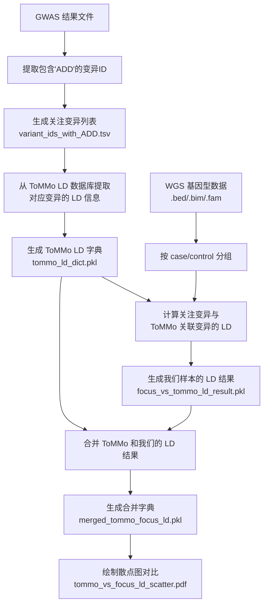

# ToMMo LD 比较分析项目

## 项目概述

本项目用于比较我们的慢性血栓栓塞性肺高压（CTEPH）基因型数据与日本人群参考数据库 ToMMo 60KJPN 中的连锁不平衡（LD）模式。通过这种比较，我们可以验证公开数据库中的 LD 模式是否适用于我们的研究群体，并识别群体特异性的遗传结构差异。

## 分析流程



## 文件结构

```
02.tommo_ld_compare/
├── README.md                          # 项目文档（本文件）
├── tommo_ld_main.ipynb               # 主分析脚本
├── variant_ids_with_ADD.tsv          # 关注变异列表
├── tommo_ld_dict.pkl                 # ToMMo LD 提取结果
├── focus_vs_tommo_ld_result.pkl      # 我们样本的 LD 计算结果
├── merged_tommo_focus_ld.pkl         # 合并后的 LD 对比数据
├── tommo_vs_focus_ld_scatter.pdf     # LD 对比散点图
└── tmp/                              # 临时文件目录
    ├── case_data.*                   # case 组基因型数据
    ├── ctrl_data.*                   # control 组基因型数据
    └── *_ld.*                        # PLINK LD 计算结果
```

## 主要分析步骤

### 1. 数据预处理

从 GWAS 结果中提取包含 'ADD' 测试的变异ID：

```python
# 从 GWAS 摘要统计中筛选关注变异
gwas_df = pd.read_csv(gwas_path)
variant_ids = gwas_df[gwas_df['TEST'].apply(contains_add)]['ID'].tolist()
```

输入文件：`gwas_summary.plink2.csv`
输出文件：`variant_ids_with_ADD.tsv`

### 2. ToMMo LD 数据提取

使用 `tommo_ld_tools.extract_ld_from_tommo_for_focus_loci()` 函数从 ToMMo 数据库中提取关注变异的 LD 信息：

```python
tommo_ld_dict_path, tommo_ld_log = extract_ld_from_tommo_for_focus_loci(
    focus_loci_path, tommo_ld_dir
)
```

功能：
- 使用 `tabix` 查询 ToMMo LD 数据库（按染色体分割的 .tsv.gz 文件）
- 提取每个关注变异与其他变异的 r² 值
- 生成匹配日志和 pickle 格式的结果字典

### 3. 样本 LD 计算

使用 `tommo_ld_tools.compute_ld_between_focus_and_tommo_linked_variants()` 函数计算我们样本中的 LD：

```python
focus_ld_dict_path = compute_ld_between_focus_and_tommo_linked_variants(
    tommo_dict=tommo_ld_dict,
    bed_prefix=wgs_bed_prefix,
    case_prefix=case_prefix,
    plink2_path=plink2_path,
    threads=6
)
```

功能：
- 将样本按 case/control 分组（基于样本ID前缀）
- 使用 PLINK2 计算关注变异与 ToMMo 关联变异的 LD
- 处理缺失变异和反向查询补全
- 生成 case/control 各自的 LD 结果表

### 4. 数据合并

使用 `tommo_ld_tools.merge_tommo_and_focus_ld_dict()` 函数合并两个数据源的 LD 结果：

```python
merged_dict_path = merge_tommo_and_focus_ld_dict(
    tommo_ld_dict_path, focus_ld_dict_path, select='control'
)
```

功能：
- 根据变异ID匹配 ToMMo 和我们样本的 LD 值
- 在结果表中插入 `TOMMO_R2` 列
- 标注未匹配的记录

### 5. 结果可视化

使用 `tommo_ld_tools.plot_ld_comparison_from_merged_dict()` 函数生成对比图：

```python
plot_ld_comparison_from_merged_dict(merged_dict_path, select='control')
```

功能：
- 为每个关注变异绘制散点图（x轴：ToMMo R²，y轴：我们样本的 R²）
- 添加 y=x 参考线
- 标注数据点数量和缺失情况
- 输出多页 PDF 报告

## 技术细节

### 数据格式

**关注变异格式**: `chr:pos:ref:alt`（如：`chr3:154069965:A:G`）

**ToMMo LD 文件格式**: 
- 文件名：`tommo-54kjpn-20230828-GRCh38-autosome-{chr}-plink-r2.tsv.gz`
- 列：variation1_id, variation1_chromosome, variation1_position, variation1_reference, variation1_alternative, variation1_maf, variation2_id, variation2_chromosome, variation2_position, variation2_reference, variation2_alternative, variation2_maf, r2

**PLINK LD 输出格式**:
- CHROM_A, POS_A, ID_A：目标变异信息
- CHROM_B, POS_B, ID_B：关联变异信息  
- UNPHASED_R2：计算得到的 r² 值

### 关键参数

- **LD 窗口大小**: 1000 kb（用于 ToMMo 查询）/ 2000 kb（用于 PLINK 计算）
- **最小 r² 阈值**: 0.2（ToMMo）/ 0.0（PLINK，保留所有结果）
- **并行线程数**: 6（可调整）
- **样本分组**: 基于样本ID前缀（如 "PHOM" 为 case）

### 依赖工具

- **Python 包**: pandas, matplotlib, pickle, subprocess
- **外部工具**: 
  - `tabix`：用于查询 ToMMo 压缩数据文件
  - `plink2`：用于 LD 计算
- **数据源**: 
  - ToMMo 60KJPN LD 数据库
  - CTEPH WGS 基因型数据（.bed/.bim/.fam 格式）

## 结果解读

### LD 对比散点图

每个关注变异对应一个散点图页面：

1. **散点分布**：理想情况下应沿 y=x 线分布，表示两个群体 LD 模式一致
2. **偏离模式**：
   - 点位于对角线下方：我们样本的 LD 低于 ToMMo
   - 点位于对角线上方：我们样本的 LD 高于 ToMMo
3. **数据覆盖**：
   - ToMMo LD pairs available：ToMMo 中该变异的关联变异数量
   - LD pairs computed：在我们样本中成功计算 LD 的变异对数量

### 特殊情况说明

- **"No LD information found in ToMMo"**：ToMMo 数据库中未找到该变异的 LD 信息
- **"ToMMo found LD variants, but none were found in the user's genotype data"**：ToMMo 中有 LD 信息，但关联变异在我们的基因型数据中缺失

## 应用场景

1. **群体遗传学验证**：验证参考数据库的 LD 模式是否适用于研究群体
2. **GWAS 质量控制**：评估基因型数据的质量和群体结构
3. **精细定位研究**：为后续的精细定位分析提供 LD 背景信息
4. **Meta 分析准备**：评估不同研究群体间的遗传背景一致性

## 使用建议

1. **数据质量**：建议在高质量的 WGS 数据或深度充足的芯片数据上运行
2. **计算资源**：使用多线程并行计算（推荐 4-8 线程）
3. **内存管理**：大规模分析时注意内存使用，可考虑分批处理
4. **结果验证**：结合生物学背景知识解读 LD 差异的合理性

---

**作者**: ZHAO TIE  
**创建日期**: 2025年  
**最后更新**: 2025年9月