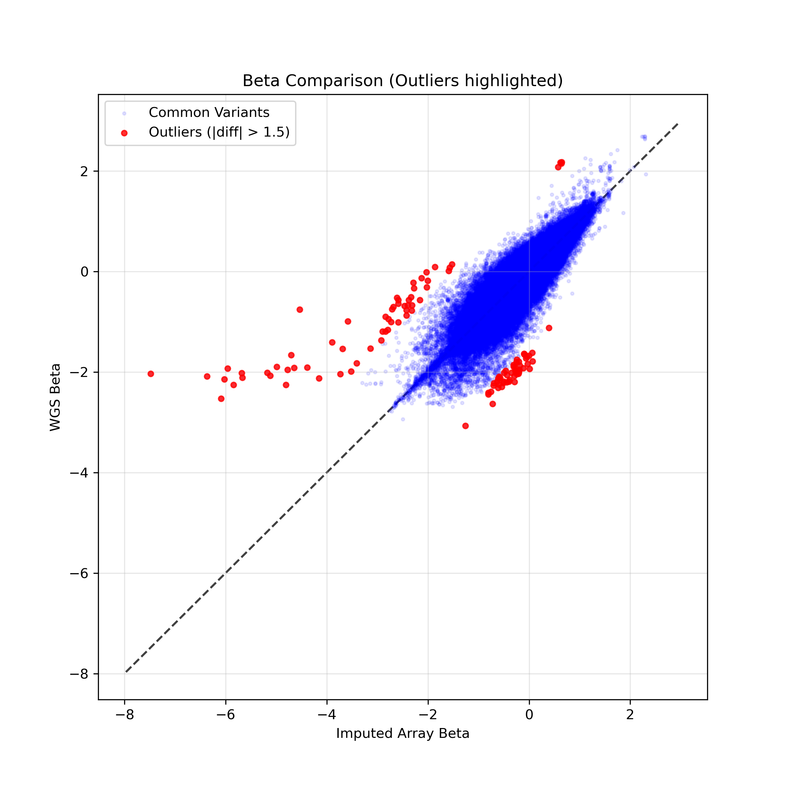
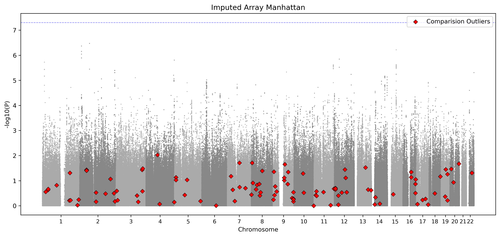
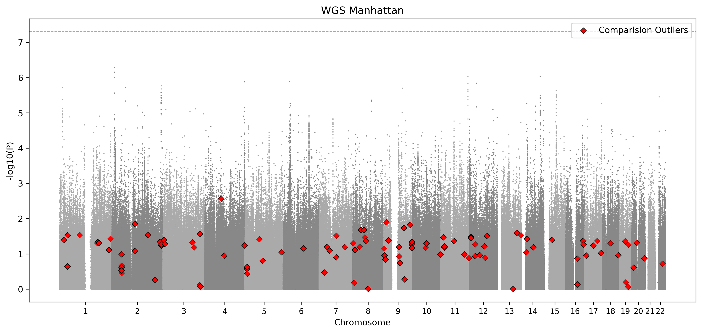
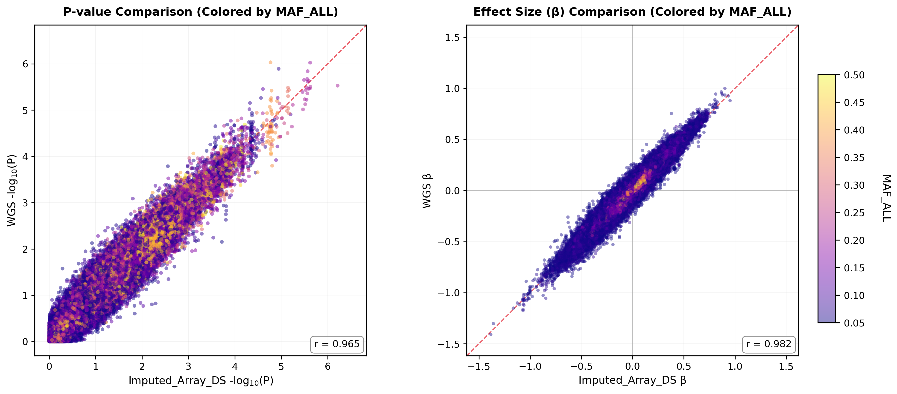
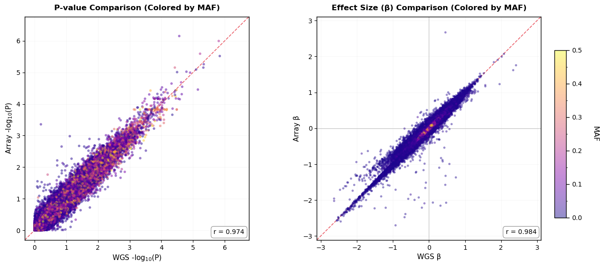

# Investigation of Beta Striations in Imputed GT vs WGS Comparison
## Systematic Discrepancy Analysis

### 1. Visual Comparison
We compared the concordance of GWAS Effect Sizes ($\beta$) derived from **Imputed Array Hard Calls (GT)** versus **Imputed Array Dosage (DS)** against the WGS Gold Standard.

#### Figure 1: Imputed Array GT (Hard Call) vs WGS
*Note the distinct "striations" or multiple linear rays in the Beta comparison (Right Panel).*

#### Figure 2: Imputed Array DS (Dosage) vs WGS
*Note the smoother, single-diagonal consistency compared to GT.*

---

### 2. Academic Explanation: Quantization & Uncertainty Removal
The phenomenon of "multiple lines" or **Striation** observed in the GT-based comparison is not merely "error," but a structural artifact arising from the **removal of probabilistic uncertainty** during the conversion from Dosage (DS) to Hard Calls (GT).

#### A. Dosage (DS): Uncertainty as a Smoothing Factor
In the Dosage model, genotypes are continuous values derived from posterior probabilities (e.g., $DS = 0.9$ implies 90% certainty of a Het).
*   **Continuous Scatter:** This "uncertainty" provides fine-grained variation. Two variants where the imputation is slightly "unsure" might have Dosages of $0.85$ and $1.15$ respectively. 
*   **Visual Effect:** This continuous variation scatters the Beta estimates. Even if the imputation is systematically underestimating the signal, the varying levels of "confidence" ($DS \in [0, 2]$) diffuse the points into a smooth cloud or a single wide diagonal.

#### B. Hard Calls (GT): Removal of Uncertainty "Crystallizes" Artifacts
Converting to Hard Calls (GT) **removes the uncertainty**, collapsing probability distributions into discrete Integers ($0, 1, 2$). This process "quantizes" the data.
*   **Collapsing Variance:** Distinct variants that previously had unique Dosage profiles (e.g., DS=0.8, 0.9, 1.2) are all forced into the exact same integer vector ($GT=1$).
*   **Emergence of Striations:** By removing the "jitter" of uncertainty, we force variants into a finite set of **Discrete Mismatch Configurations**.
    *   *Example:* Consider a set of low-frequency variants where WGS sees 5 Hets, but the Imputation consistently has lower confidence.
    *   In **DS**, the sums might be $3.8, 4.1, 4.2$. The Betas scatter.
    *   In **GT** (cutoff 0.9), they all snap to exactly $4$ Hets.
    *   **Result:** All these variants now have the **exact same** regressor matrix $X$, forcing their Effect Sizes ($\beta$) to fall onto the **exact same linear ray** (slope $\approx 4/5$).

#### C. Summary
The "lines" in the GT plot appear because we have stripped away the continuous probability masking. The **removal of uncertainty** effectively crystallizes the diffuse cloud of systematic discordance into sharp, discrete linear rays.

### 3. Investigation of Dosage (DS) vs WGS Discordance
While Dosage (DS) corrects the "Striation" artifact, some discordance remains. We investigated whether these residuals are driven by specific genomic regions (e.g., structural variation hotspots) or systematic frequency limitations.

#### A. Outlier Analysis (Systematic vs Regional)
We defined "Outliers" as variants with extreme Beta differences between WGS and Imputed DS ($|\beta_{wgs} - \beta_{ds}| > 1.5$) to see if they cluster spatially.

**Figure 3: Beta Comparison with Outliers**
*(Red points indicate high discordance)*

**Figure 4: Spatial Distribution of Outliers (Manhattan Plots)**
*The outliers (Red Diamonds) are distributed sporadically across all chromosomes (1-22), rather than clustering in specific difficult regions.*

#### B. Frequency-Dependent Limitations (MAF 0.01 - 0.05)
Coloring the comparison by Minor Allele Frequency (MAF) reveals the primary driver of the remaining discordance.

**Figure 5: Effect Size by MAF**
*Note that the "Purple" points (Low MAF) constitute the majority of offset variants, whereas "Yellow" points (Common variants) lie tightly on the diagonal.*

#### C. Verification: High Concordance in Common Variants (MAF $\ge$ 0.05)
To validate that the discordance is strictly limited to low-frequency variants, we filtered the dataset to include only common variants (MAF $\ge$ 0.05).

**Figure 6: Beta Comparison (MAF $\ge$ 0.05 Only)**
*When restricting to Common Variants, the "cloud" of discordant points disappears, and the correlation becomes extremely tight ($r > 0.98$). This confirms that the Array Imputation performs excellently for the vast majority of common variation.*

### 4. Investigation of Discordance Mechanism (MAF < 0.05)
The previous analysis showed that residual discordance is concentrated in low-frequency variants (MAF < 0.05). A critical question remains: **Is this discordance due to "Bad Genotyping" by the array hardware, or "Bad Inference" by the imputation algorithm?**

#### A. Direct Genotyping Validation (Raw Array vs WGS)
To answer this, we compared the **Raw Genotyped Array data** (before imputation) directly against WGS for the subset of markers present on the chip.

**Figure 7: Raw Array Genotypes vs WGS (Colored by MAF)**
*Note: Even for low-MAF variants (Purple points), the correlation is high and the points lie on the diagonal.*

#### B. The "Scaffold Noise" Hypothesis (Array Error)
The comparison in Figure 7 refutes the "Perfect Hardware" assumption and reveals a foundational limitation:

1.  **Visible Scatter in MAF 0.01-0.05:** While variants with high MAF (Yellow) lie tightly on the diagonal, **variants with MAF 0.01-0.05 (Purple points)** exhibit visible scatter and deviation from the identity line even in the raw array data.
2.  **Genotying Instability:** This indicates that **Array Genotyping itself is less precise** for variants in this frequency range. Genotyping calls depend on clustering algorithms that need sufficient heterozygotes to define cluster boundaries. At MAF < 0.05, the scarcity of heterozygotes leads to unstable cluster definitions and "noisy" hard calls.
3.  **Propagation of Error:** This creates a "Noisy Scaffold." Imputation algorithms treat the array genotypes as the ground truth backbone. If the backbone itself has measurement error (deviations from WGS), this error propagates to all variants inferred from it.
4.  **Conclusion:** The final discordance is not just about "missing" variants. It stems from the fact that the **Scaffold itself** (the raw array data) loses precision in the MAF 0.01-0.05 range.

### 5. Final Conclusion & Recommendation
1.  **Striations in GT:** Caused by the artificial discretization of uncertainty (Hard Calling). **Solution: Use Dosage (DS).**
2.  **DS vs WGS Discordance:** Concentrated in variants with **MAF 0.01-0.05** which constitute the "Scaffold Noise." (Note: Variants with MAF < 0.01 were excluded from this analysis).
3.  **Mechanism:** **Compound Error.**
    *   **Source 1 (Genotyping):** The Array hardware/clustering struggles to precisely call variants with MAF 0.01-0.05 due to low het counts (Figure 7 scatter).
    *   **Source 2 (Inference):** Imputation on top of a noisy scaffold further dilutes the signal.
4.  **Recommendation:**
    *   **Use Dosage (DS)** for all stats.
    *   **Interpretation Caution:** Results for variants with MAF 0.01-0.05 should be treated with caution. They suffer from both lower genotyping precision and lower imputation quality. This is an inherent platform limitation.
