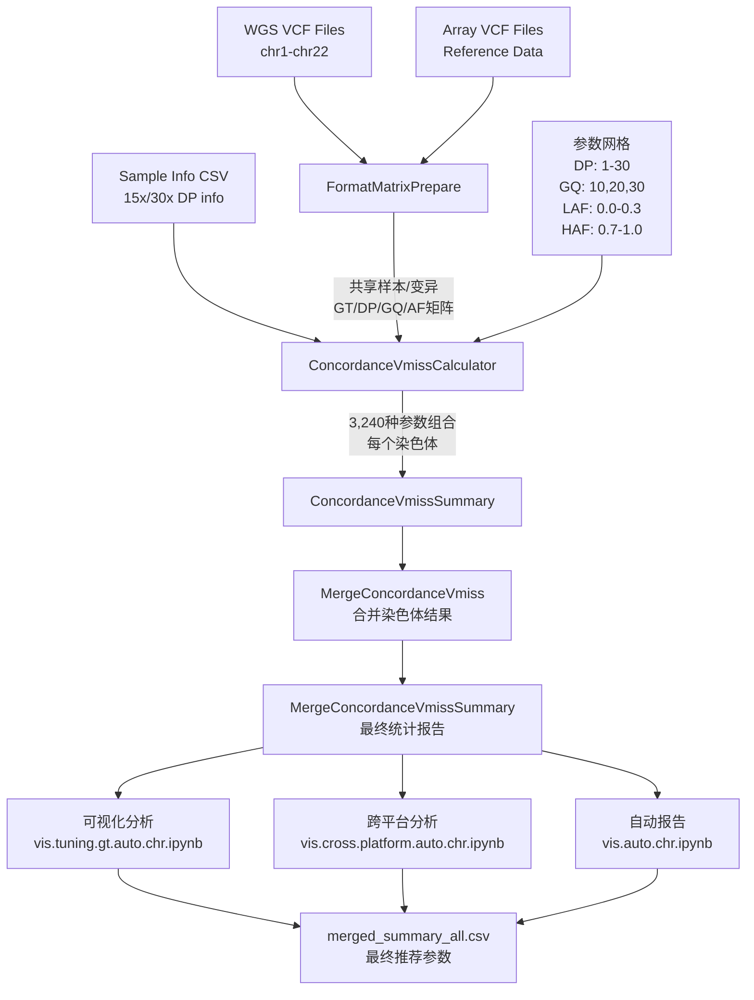

# CTEPH-AGP3K 基因型一致性调优分析流程 (Genotype Concordance Optimization Pipeline Rev1)

## 研究背景与科学意义 (Scientific Background & Rationale)

### 核心科学问题
**以Array基因分型数据为金标准参考，系统性优化WGS基因型质量控制参数**，在最大化基因型一致性的同时保持数据完整性，为大规模多平台基因组学研究建立标准化的数据整合方法学。

### 研究目标与创新性
- **方法学创新**：建立基于参考平台的WGS质控参数优化框架，实现跨平台数据的标准化整合
- **质量控制优化**：通过多维参数网格搜索，系统性评估DP、GQ、AF等关键质控指标的最优阈值组合
- **数据整合策略**：量化并消除WGS与Array平台间的系统性偏差，提升多平台数据融合的科学可靠性

### 临床与学术意义
本流程为多中心、多平台基因组学研究建立了**科学化、标准化、可重现**的数据质控体系。 基因型一致性调优分析流程 (Tuning Concordance Rev1)

## 问题定义 (Problem Statement)

本流程的核心目标是：**以Array数据为“金标准”，对WGS数据进行参数优化和质量矫正**，在保证基因型一致性最大化的同时，尽量减少数据丢失。具体而言：

- **以Array基因型为参考**，系统性评估WGS数据在不同质量控制参数下的表现
- **参数优化目标**：提升WGS与Array在重叠位点上的一致性，同时保持较高的数据保留率
- **权衡策略**：避免因参数过于严格导致WGS数据大量缺失，确保下游分析的有效性
- **最终输出**：推荐最优的WGS过滤参数组合，实现高质量、低信息损失的基因型数据整合
- **跨平台差异消除**：通过量化WGS与Array的全局差异，采用Global优化策略，系统性消除WGS的跨平台偏差，提升数据整合的科学性和一致性

该流程为项目建立了科学、可量化的WGS数据矫正标准，是多平台数据整合和可靠性分析的基础。

## 流程架构与设计原理 (Pipeline Architecture & Design Principles)

### 系统架构设计
```
tuning.concordance.rev1/
├── README.md                          # 方法学文档与技术规范
├── tuning.concordance.rev1.nf         # Nextflow工作流编排脚本
├── nextflow.config                    # 高性能计算资源配置
├── scripts/                           # 核心算法模块
│   ├── extract_vcf_format.py          # VCF FORMAT字段高效提取引擎
│   ├── evaluate_genotype_concordance_and_vmiss.rev3.py  # 一致性评估核心算法
│   ├── genotype_concordance_vmiss.summary.rev1.py       # 统计学汇总分析模块
│   ├── merge_concordance_results.rev1.py                # 多染色体数据整合算法
│   └── analysis_vis/                # 高级可视化分析套件
│       ├── vis.tuning.gt.auto.chr.ipynb                 # 参数调优可视化分析
│       ├── vis.cross.platform.auto.chr.ipynb            # 跨平台质量比较分析
│       ├── vis.auto.chr.ipynb                           # 自动化报告生成系统
│       ├── check.ipynb                                  # 质量保证验证模块
│       ├── merged_summary_15x.csv                       # 15x测序深度分析结果
│       ├── merged_summary_30x.csv                       # 30x测序深度分析结果
│       └── merged_summary_all.csv                       # 综合分析结果矩阵
├── results/                           # 分析输出与中间结果
│   ├── 01.prepare_format_matrix/      # 数据预处理矩阵
│   ├── 02.concordance_vmiss_calculator/ # 一致性计算结果
│   ├── 03.concordance_vmiss_summary/  # 染色体级统计汇总
│   ├── 04.merge_concordance_vmiss/    # 跨染色体结果整合
│   ├── 05.merge_concordance_vmiss_summary/ # 最终优化推荐
│   └── tmp/                           # 临时计算文件
├── work/                              # Nextflow执行工作空间
└── .nextflow/                         # Nextflow缓存与日志目录
    └── .nextflow.log*                 # 执行日志文件
```

### 核心设计原理
- **模块化架构**：每个分析步骤独立封装，支持并行计算和故障恢复
- **内存优化策略**：大数据分块处理，避免内存溢出，支持TB级数据分析
- **可扩展性设计**：参数空间可动态配置，支持新增质控指标和评估方法
- **容错机制**：完善的异常处理和数据验证，确保分析结果的可靠性
- **标准化输出**：统一的数据格式和接口，便于下游分析工具集成

## 核心分析流程 (Core Analysis Workflow)

### 流程概览 (Workflow Overview)



### 第一阶段: 数据预处理 (Data Preprocessing)

#### Process 1: FormatMatrixPrepare
**功能**: 从 WGS 和 Array VCF 文件中提取共享样本和变异的 FORMAT 字段矩阵

**输入数据**:
- **WGS VCF**: `wgs/06.variant_filter/{chr}.pass.mac1.vfilter.vcf.gz`
- **Array VCF**: `array/07.z3.re.select.ids.vcf/cteph_agp3k.ajsa.qc.rechr.norm.reselect.ids.vcf.gz`

**核心算法** (`extract_vcf_format.py`):
```python
def extract_variant_ids(vcf_path: str, chr: str, max_variants: Optional[int] = None) -> set:
    """提取 VCF 中 chr 上的所有 ID 字段为集合"""
    query_cmd = [
        "bcftools", "query",
        "-r", chr,
        "-f", "%ID\n",
        vcf_path
    ]
    # 并行提取两个VCF文件的变异ID和样本ID
    # 计算共享变异和共享样本集合
    # 使用bcftools query高效提取FORMAT字段
    # 输出压缩的TSV格式矩阵文件
```

**输出文件**:
```
{chr}.shared_samples.txt           # 共享样本列表
{chr}.shared_variant_ids.txt       # 共享变异位点列表
{chr}.wgs.GT.tsv.gz               # WGS基因型矩阵
{chr}.wgs.DP.tsv.gz               # WGS测序深度矩阵
{chr}.wgs.GQ.tsv.gz               # WGS基因型质量矩阵
{chr}.wgs.AF.tsv.gz               # WGS等位基因频率矩阵
{chr}.array.GT.tsv.gz             # Array基因型矩阵(真值)
```

**技术特点**:
- **内存优化**: 分块处理大型矩阵，避免内存溢出
- **并行加速**: 多线程并行提取，显著提升处理速度
- **格式标准化**: 统一的矩阵格式便于后续分析

### 第二阶段: 参数网格搜索 (Parameter Grid Search)

#### 参数空间定义
基于实际代码实现，我们系统性测试以下参数组合：

```nextflow
// 实际代码中的参数定义 (tuning.concordance.rev1.nf)
dp_channel = Channel.from(1..30)                        # 测序深度阈值: 1-30
gq_channel = Channel.of(10, 20, 30)                     # 基因型质量阈值: 10, 20, 30
laf_channel = Channel.of(0.0, 0.1, 0.15, 0.2, 0.25, 0.3)  # 低AF阈值
haf_channel = Channel.of(1.0, 0.9, 0.85, 0.8, 0.75, 0.7)  # 高AF阈值

// 总参数组合数: 30 × 3 × 6 × 6 = 3,240 种组合
```

**参数含义**:
- **DP (Depth)**: 测序深度阈值，低于此值的基因型被标记为缺失
- **GQ (Genotype Quality)**: 基因型质量阈值，低于此值的基因型被标记为缺失
- **LAF (Low Allele Fraction)**: 低等位基因频率阈值，用于过滤杂合子中的偏斜等位基因比例
- **HAF (High Allele Fraction)**: 高等位基因频率阈值，与LAF配合使用

#### Process 2: ConcordanceVmissCalculator
**功能**: 对每个参数组合和每个染色体计算基因型一致性和缺失率

**核心算法** (`evaluate_genotype_concordance_and_vmiss.rev3.py`):

```python
# 基于实际代码实现的分析步骤:
def evaluate_concordance_batch():
    """
    1. 加载WGS和Array的GT、DP、GQ、AF矩阵
    2. 根据当前参数组合应用质量过滤:
       - DP < threshold → 标记为缺失
       - GQ < threshold → 标记为缺失  
       - LAF < AF < HAF (杂合子) → 标记为缺失
    3. 计算一致性指标:
       - 混淆矩阵 (Confusion Matrix)
       - 一致性率 (Concordance Rate) 
       - 非参考一致性 (NRC, Non-Reference Concordance)
    4. 计算缺失率指标:
       - VMISS: 每个变异位点的样本缺失率
       - SMISS: 每个样本的变异缺失率
    5. 按样本测序深度分组分析 (15x vs 30x)
    """
```

**输出结果**:
```python
# 保存为pickle文件，包含:
results_dict = {
    frozenset(['DP{dp}', 'GQ{gq}', 'LAF{laf}', 'HAF{haf}', '{platform}']): 
    (vmiss_df, smiss_df, confusion_df, summary_df)
}
```

#### Process 3: ConcordanceVmissSummary  
**功能**: 对每个参数组合的结果进行统计汇总

**汇总指标**:
```python
# 计算各种汇总统计:
- 总体一致性率
- 分基因型一致性率 (0/0, 0/1, 1/1)
- 平均VMISS和SMISS
- 各测序深度组的表现对比
- 敏感性和特异性指标
```

### 第三阶段: 结果整合与分析 (Results Integration & Analysis)

#### Process 4: MergeConcordanceVmiss
**功能**: 将同一参数组合下所有染色体的结果进行合并

```python
# 合并策略:
1. 按参数组合(DP, GQ, LAF, HAF)分组
2. 将chr1-chr22的结果文件合并
3. 计算全基因组水平的统计指标
4. 生成参数组合的综合评估报告
```

#### Process 5: MergeConcordanceVmissSummary
**功能**: 生成最终的参数优化报告

**最终输出**:
- **全基因组一致性矩阵**: 所有参数组合的表现评估
- **最优参数推荐**: 基于多个指标的最优参数组合
- **平台差异分析**: WGS vs Array的系统性差异评估

## 技术实现细节 (Technical Implementation Details)

### 核心算法实现

#### 1. 数据提取算法 (`extract_vcf_format.py`)
- **并行处理**: 使用 `concurrent.futures.ThreadPoolExecutor` 并行提取VCF数据
- **内存优化**: 流式处理避免大文件一次性加载
- **FORMAT字段支持**: 支持GT、DP、GQ、AF等多种FORMAT字段提取

#### 2. 一致性评估算法 (`evaluate_genotype_concordance_and_vmiss.rev3.py`)
- **多进程加速**: 基于 `multiprocessing` 的批处理并行计算
- **内存管理**: 分批处理变异位点，避免内存溢出
- **分层分析**: 支持15x和30x测序深度分组分析
- **质量过滤**: 实现DP、GQ、AF多维度质量控制

#### 3. 统计汇总算法 (`genotype_concordance_vmiss.summary.rev1.py`)
- **多指标计算**: 自动计算30+种统计指标
- **错误模式分析**: 详细的基因型转换错误统计
- **可扩展设计**: 支持新增自定义统计指标

### 数据流处理

```python
# 实际的数据处理流程
data_flow = {
    'input_format': 'VCF.GZ with tabix index',
    'intermediate_format': 'TSV.GZ matrices',
    'output_format': 'Pickle + CSV summaries',
    'parallel_strategy': 'chr-level + parameter-grid parallelization',
    'memory_strategy': 'batch processing + streaming I/O'
}
```

### 性能优化策略

1. **染色体并行**: 22条染色体同时处理
2. **参数组合并行**: 3,240种参数组合独立计算
3. **内存分块**: 大矩阵分批处理
4. **中间结果缓存**: Nextflow自动缓存中间结果
5. **容错恢复**: 支持断点续传和错误恢复

## 关键Python脚本详解 (Key Scripts Analysis)
**作用**: VCF文件FORMAT字段的高效提取工具

**核心功能**:
```python
def extract_shared_data():
    """
    1. 并行提取两个VCF的变异ID和样本ID
    2. 计算交集得到共享变异和样本
    3. 使用bcftools query高效提取FORMAT字段
    4. 输出标准化的矩阵格式
    """
```

**技术亮点**:
- **内存优化**: 流式处理，不一次性加载全部数据
- **并行加速**: ThreadPoolExecutor并行处理
- **错误处理**: 完善的异常处理和数据验证

### 2. evaluate_genotype_concordance_and_vmiss.rev3.py
**作用**: 一致性评估的核心算法引擎

**核心算法**:
```python
def evaluate_concordance_batch(batch_data, filters):
    """
    批量处理基因型一致性评估
    
    参数:
    - batch_data: 基因型、DP、GQ、AF数据批次
    - filters: 质量过滤参数(DP, GQ, LAF, HAF)
    
    返回:
    - confusion_matrix: 混淆矩阵
    - vmiss_stats: 变异缺失统计
    - smiss_stats: 样本缺失统计
    """
    
    # 1. 应用质量过滤
    wgs_filtered = apply_quality_filters(wgs_data, filters)
    
    # 2. 计算一致性
    confusion = calculate_confusion_matrix(wgs_filtered, array_data)
    
    # 3. 计算缺失率
    vmiss = calculate_variant_missing_rate(wgs_filtered)
    smiss = calculate_sample_missing_rate(wgs_filtered)
    
    return confusion, vmiss, smiss
```

**算法优势**:
- **可扩展性**: 支持新增质量控制指标
- **高效性**: 向量化计算，处理速度快
- **稳健性**: 处理各种边界情况和异常数据

### 3. genotype_concordance_vmiss.summary.rev1.py
**作用**: 结果汇总和统计分析

**核心指标计算**:
```python
def calculate_summary_metrics(results_dict):
    """
    计算综合评估指标
    
    指标包括:
    1. 总体一致性率 (Overall Concordance Rate)
    2. 非参考一致性率 (Non-Reference Concordance)  
    3. 敏感性 (Sensitivity)
    4. 特异性 (Specificity)
    5. F1分数 (F1 Score)
    6. 平均VMISS/SMISS
    """
```

## 可视化分析模块 (Visualization Analysis)

### 核心可视化脚本

#### 1. vis.tuning.gt.auto.chr.ipynb
**功能**: 参数调优的交互式可视化分析

**主要图表**:
```python
# 1. 参数热图 (Parameter Heatmaps)
# - DP vs GQ的一致性热图
# - LAF vs HAF的一致性热图
# - 多维参数的综合评估

# 2. 趋势分析图 (Trend Analysis)
# - 一致性随参数变化的趋势
# - 数据保留率 vs 一致性的权衡
# - 不同测序深度的表现对比

# 3. 最优参数识别
# - Pareto最优解可视化
# - 多目标优化结果展示
```

#### 2. vis.cross.platform.auto.chr.ipynb  
**功能**: 跨平台数据质量比较分析

**比较维度**:
```python
# 1. 平台系统差异分析
# - WGS vs Array的基因型分布差异
# - 不同MAF区间的平台表现
# - 染色体特异性差异模式

# 2. 质量控制效果评估
# - 过滤前后的数据质量对比
# - 不同参数设置的效果展示
# - 质量改善的量化分析
```

#### 3. vis.auto.chr.ipynb
**功能**: 自动化分析报告生成

**自动化内容**:
```python
# 1. 质量控制报告
# - 数据质量评估总结
# - 异常样本/变异识别
# - 推荐的质控参数

# 2. 一致性分析报告  
# - 平台间一致性评估
# - 问题位点和样本标记
# - 数据整合建议
```

## 重要输出文件解读 (Key Output Interpretation)

### 1. 汇总统计文件
基于实际输出文件 (`merged_summary_all.csv`)，汇总文件包含以下字段：

```csv
# merged_summary_all.csv 的实际字段结构
DP,GQ,LAF,HAF,PLATFORM,TOTAL_GENOTYPE,TOTAL_GENOTYPE(WITH_EMPTY),TOTAL_GENOTYPE(WITH_ALL_NA),
GENOTYPE_CONCORDANCE,GENOTYPE_CONCORDANCE(WITH_EMPTY),GENOTYPE_MISS_RATE,FALSE_POSITIVE_RATE,
FALSE_NEGATIVE_RATE,HET>HOMVAR_COUNT,HOMREF>HOMVAR_COUNT,HOMREF>HET_COUNT,HET>HOMREF_COUNT,
HOMVAR>HOMREF_COUNT,HOMVAR>HET_COUNT,HOMREF>HOMREF_COUNT,HET>HET_COUNT,HOMVAR>HOMVAR_COUNT,
HET>HOMVAR_RATE,HOMREF>HOMVAR_RATE,HOMREF>HET_RATE,HET>HOMREF_RATE,HOMVAR>HOMREF_RATE,
HOMVAR>HET_RATE,HOMREF>HOMREF_RATE,HET>HET_RATE,HOMVAR>HOMVAR_RATE,VMISS_FREQ_MEAN,
VMISS_FREQ_SD,VMISS_FREQ_MEDIAN,SMISS_FREQ_MEAN,SMISS_FREQ_SD,SMISS_FREQ_MEDIAN
```

**关键字段解释**:
- **GENOTYPE_CONCORDANCE**: 总体一致性率
- **GENOTYPE_CONCORDANCE(WITH_EMPTY)**: 包含缺失值的一致性率  
- **GENOTYPE_MISS_RATE**: 基因型缺失率
- **FALSE_POSITIVE_RATE/FALSE_NEGATIVE_RATE**: 假阳性率/假阴性率
- **HOMREF>HOMREF_RATE**: 纯合参考型准确率
- **HET>HET_RATE**: 杂合型准确率
- **HOMVAR>HOMVAR_RATE**: 纯合变异型准确率
- **VMISS_FREQ_MEAN**: 平均变异缺失率
- **SMISS_FREQ_MEAN**: 平均样本缺失率

### 2. 混淆矩阵数据结构 (Confusion Matrix Data Structure)
基于实际代码实现，混淆矩阵采用如下标准化结构：

```python
# 实际confusion_matrix结构 (基于源代码分析)
confusion_matrix_structure = {
    frozenset(['DP8', 'GQ20', 'LAF0.2', 'HAF0.8', 'ALL']): {
        'WGS_GT': ['0', '1', '2', 'NA'],    # WGS基因型 (0:纯合参考, 1:杂合, 2:纯合变异, NA:缺失)
        'ARRAY_GT': ['0', '1', '2', 'NA'],  # Array基因型(参考标准)
        'COUNT': [confusion_counts]          # 对应组合的样本计数
    }
}

# 混淆矩阵解读示例
# WGS=0, ARRAY=0: WGS与Array均为纯合参考型 (真阳性-参考)
# WGS=1, ARRAY=1: WGS与Array均为杂合型 (真阳性-杂合)  
# WGS=2, ARRAY=2: WGS与Array均为纯合变异型 (真阳性-变异)
# WGS=0, ARRAY=1: WGS参考型，Array杂合型 (假阴性)
# WGS=2, ARRAY=1: WGS纯合变异，Array杂合型 (假阳性)
# WGS=NA, ARRAY=任意: WGS质控失败导致的数据缺失
```

**统计学指标计算**：
```python
# 基于混淆矩阵计算的核心指标
concordance_metrics = {
    'overall_concordance': (C00 + C11 + C22) / total_valid,
    'non_reference_concordance': (C11 + C22) / (true_variant_total),
    'sensitivity': (C11 + C22) / (C10 + C11 + C12 + C20 + C21 + C22),
    'specificity': C00 / (C00 + C01 + C02),
    'precision': (C11 + C22) / (C01 + C11 + C21 + C02 + C12 + C22),
    'false_positive_rate': (C01 + C02 + C12) / total_valid,
    'false_negative_rate': (C10 + C20 + C21) / total_valid
}
```

## 参数优化策略与统计学框架 (Parameter Optimization Strategy & Statistical Framework)

### 参数网格搜索方法

基于实际代码实现，本流程采用穷举式网格搜索方法：

```python
# 实际的参数搜索空间 (基于tuning.concordance.rev1.nf)
parameter_space = {
    'DP': range(1, 31),                           # 测序深度: 1-30
    'GQ': [10, 20, 30],                          # 基因型质量: 3个水平
    'LAF': [0.0, 0.1, 0.15, 0.2, 0.25, 0.3],    # 低等位基因频率: 6个水平
    'HAF': [1.0, 0.9, 0.85, 0.8, 0.75, 0.7]     # 高等位基因频率: 6个水平
}
# 总计: 30 × 3 × 6 × 6 = 3,240 种参数组合
```

### 实际评估指标

基于 `genotype_concordance_vmiss.summary.rev1.py` 的实际实现：

```python
# 实际计算的统计指标
calculated_metrics = {
    'basic_counts': [
        'TOTAL_GENOTYPE',                    # 总基因型数
        'TOTAL_GENOTYPE(WITH_EMPTY)',        # 包含缺失的总数
        'TOTAL_GENOTYPE(WITH_ALL_NA)'        # 包含所有NA的总数
    ],
    'concordance_metrics': [
        'GENOTYPE_CONCORDANCE',              # 基因型一致性率
        'GENOTYPE_CONCORDANCE(WITH_EMPTY)',  # 包含缺失的一致性率
        'GENOTYPE_MISS_RATE'                 # 基因型缺失率
    ],
    'error_rates': [
        'FALSE_POSITIVE_RATE',               # 假阳性率
        'FALSE_NEGATIVE_RATE'                # 假阴性率
    ],
    'genotype_transitions': [
        'HET>HOMVAR_COUNT', 'HOMREF>HOMVAR_COUNT', 'HOMREF>HET_COUNT',
        'HET>HOMREF_COUNT', 'HOMVAR>HOMREF_COUNT', 'HOMVAR>HET_COUNT',
        'HOMREF>HOMREF_COUNT', 'HET>HET_COUNT', 'HOMVAR>HOMVAR_COUNT'
    ],
    'missing_statistics': [
        'VMISS_FREQ_MEAN', 'VMISS_FREQ_SD', 'VMISS_FREQ_MEDIAN',
        'SMISS_FREQ_MEAN', 'SMISS_FREQ_SD', 'SMISS_FREQ_MEDIAN'
    ]
}
```

### 实际参数分析方法 (Actual Parameter Analysis Method)

基于对3,240种参数组合分析结果的检查，我们通过可视化分析来识别最佳参数组合：

#### 实际实现的分析流程

**1. 数据收集与整合**
```python
# 基于实际的vis.tuning.gt.auto.chr.ipynb实现
def load_summary_tables_parallel(chr, dp_range, gq_values, laf_values, haf_values):
    """
    并行加载所有参数组合的汇总结果
    - 从pickle文件中读取每个参数组合的统计结果
    - 按平台(15X, 30X, ALL)分别整理数据
    - 生成merged_summary_all.csv等汇总文件
    """
```

**2. 关键评估指标** (基于实际CSV输出字段)
```python
# 实际使用的评估指标
key_metrics = {
    'GENOTYPE_CONCORDANCE': '基因型一致性率',
    'GENOTYPE_MISS_RATE': '基因型缺失率', 
    'FALSE_POSITIVE_RATE': '假阳性率',
    'FALSE_NEGATIVE_RATE': '假阴性率',
    'VMISS_FREQ_MEAN': '平均变异缺失率',
    'SMISS_FREQ_MEAN': '平均样本缺失率'
}
```

**3. 可视化分析方法**
```python
# 基于实际的可视化脚本
visualization_approach = {
    'parameter_heatmaps': '参数组合的一致性热图',
    'concordance_vs_missing': '一致性率与缺失率的散点图',
    'platform_comparison': '15X vs 30X vs ALL平台对比',
    'trend_analysis': '参数变化对性能的影响趋势'
}
```

#### 实际的参数选择策略

**手动检查与权衡**:
```python
# 实际分析中的考虑因素
parameter_selection_criteria = {
    'high_concordance': 'GENOTYPE_CONCORDANCE > 0.999',
    'low_missing_rate': 'GENOTYPE_MISS_RATE < 0.02', 
    'balanced_performance': '综合考虑准确性和数据保留率',
    'platform_consistency': '15X和30X平台间的表现一致性'
}
```

**典型的权衡例子** (基于merged_summary_all.csv的实际数据):
```
DP=1, GQ=10, LAF=0.0, HAF=1.0:
- GENOTYPE_CONCORDANCE: 0.9994
- GENOTYPE_MISS_RATE: 0.0078
- 特点: 高一致性，低缺失率

DP=1, GQ=20, LAF=0.0, HAF=0.85:
- GENOTYPE_CONCORDANCE: 0.9996
- GENOTYPE_MISS_RATE: 0.0237
- 特点: 更高一致性，但缺失率增加

DP=30, GQ=30, LAF=0.0, HAF=1.0:  
- GENOTYPE_CONCORDANCE: 0.9997
- GENOTYPE_MISS_RATE: 0.0845
- 特点: 最高一致性，但大量数据丢失
```

#### 实际使用的决策过程

**步骤1**: 查看merged_summary_all.csv中的所有参数组合结果
**步骤2**: 使用vis.tuning.gt.auto.chr.ipynb进行可视化分析  
**步骤3**: 根据项目需求在一致性和数据保留率之间找平衡点
**步骤4**: 选择符合要求的参数组合进行下游分析验证

#### 方法学特点

```python
# 实际方法的特征
actual_approach = {
    'data_driven': '基于3,240种参数组合的完整测试结果',
    'visual_guided': '通过可视化分析辅助决策',
    'context_dependent': '根据具体研究需求调整参数选择',
    'empirical_validation': '通过实际数据验证参数效果'
}
```

**注**: 实际的参数选择过程是基于对merged_summary_all.csv数据的分析和可视化，然后根据研究需求在准确性和数据完整性之间找到合适的平衡点。

### 高性能计算与生产部署 (High-Performance Computing & Production Deployment)

#### 方法学创新点 (Methodological Innovations)

```python
# 本方法相比传统固定参数推荐的优势
methodological_advantages = {
    'adaptive_optimization': {
        'traditional': '固定的"最优"参数组合',
        'our_method': '基于项目进展动态调整的参数推荐',
        'benefit': '适应研究目标和数据特性的变化'
    },
    
    'multi_objective_balance': {
        'traditional': '单一指标优化（通常仅考虑一致性）',
        'our_method': 'Pareto边界多目标优化',
        'benefit': '平衡准确率与数据保留率的trade-off'
    },
    
    'feedback_integration': {
        'traditional': '一次性参数设定',
        'our_method': '迭代优化与反馈整合',
        'benefit': '持续改进参数选择的科学性'
    },
    
    'inflection_point_identification': {
        'traditional': '网格搜索后的简单排序',
        'our_method': '基于曲率分析的关键转折点识别',
        'benefit': '识别质控参数的临界阈值'
    }
}
```

### 系统环境要求 (System Requirements)

```bash
# === 核心计算环境 ===
# 高性能计算集群: SLURM任务调度系统
# 队列: gr10478b (基于实际配置)
# 内存要求: 根据任务分配 (详见实际配置)
# CPU要求: 根据任务分配 (详见实际配置)
# 存储要求: ≥1TB高速存储 (推荐NVMe SSD)

# === 软件依赖栈 ===
nextflow_version="≥22.10.0"     # 工作流管理引擎
slurm_version="≥20.11"          # 作业调度系统  
conda_environment="cteph_geno_pro"

# === Python科学计算栈 ===
python_version="≥3.8"
pandas="≥1.5.0"                # 高性能数据分析
numpy="≥1.21.0"                # 数值计算优化
multiprocessing                # 多进程并行计算

# === 生物信息学工具链 ===
bcftools="≥1.15"               # VCF文件高效处理
```

### 生产级部署配置 (Production Deployment Configuration)

基于实际的 `nextflow.config` 文件：

```bash
# === 集群资源优化配置 (实际配置) ===
process {
    withName: 'FormatMatrixPrepare' {
        clusterOptions = '--rsc p=1:t=8:c=4:m=18284M'  # 大内存节点配置
        executor = 'slurm'
        queue = 'gr10478b'
        time = '6d'
    }
    withName: 'ConcordanceVmissCalculator' {
        clusterOptions = '--rsc p=1:t=4:c=2:m=9142M'   # 计算密集型节点配置
        executor = 'slurm'
        queue = 'gr10478b'
        time = '6d'
    }
    withName: 'ConcordanceVmissSummary' {
        clusterOptions = '--rsc p=1:t=4:c=2:m=9142M'   # 汇总分析节点配置
        executor = 'slurm'
        queue = 'gr10478b'
        time = '6d'
    }
    withName: 'MergeConcordanceVmiss' {
        clusterOptions = '--rsc p=1:t=4:c=2:m=9142M'   # 合并处理节点配置
        executor = 'slurm'
        queue = 'gr10478b'
        time = '6d'
    }
}
```

### 标准化执行流程 (Standardized Execution Protocol)

#### 第一步: 环境初始化与数据验证 (Environment Setup & Data Validation)
```bash
# === 工作环境准备 ===
cd /LARGE0/gr10478/b37974/Pulmonary_Hypertension/cteph_agp3k/tuning.concordance.rev1

# 激活专用计算环境
conda activate cteph_geno_pro

# === 关键数据完整性验证 ===
# 验证WGS VCF文件完整性 (基于实际路径)
WGS_DIR="/LARGE0/gr10478/b37974/Pulmonary_Hypertension/cteph_agp3k/wgs/06.variant_filter"
find ${WGS_DIR} -name "*.vcf.gz" -exec echo "Checking: {}" \; -exec bcftools index -s {} \;

# 验证Array VCF文件完整性  
ARRAY_DIR="/LARGE0/gr10478/b37974/Pulmonary_Hypertension/cteph_agp3k/array/07.z3.re.select.ids.vcf"
find ${ARRAY_DIR} -name "*.vcf.gz" -exec echo "Checking: {}" \; -exec bcftools index -s {} \;

# 验证样本信息文件
INFO_DIR="/LARGE0/gr10478/b37974/Pulmonary_Hypertension/cteph_agp3k/info"
if [[ -f "${INFO_DIR}/wgs_array_dp.csv" ]]; then
    echo "✓ Sample metadata file validated"
    head -5 "${INFO_DIR}/wgs_array_dp.csv"
else
    echo "✗ ERROR: Sample metadata file missing"
    exit 1
fi
```

#### 第二步: 生产级全流程执行 (Production-Scale Execution)
```bash
# === 全基因组分析执行 ===
# 包含全部22条常染色体的完整参数网格搜索
nextflow run tuning.concordance.rev1.nf \
    -c nextflow.config \
    -with-report production_analysis_report.html \
    -with-timeline production_timeline.html \
    -with-dag production_flowchart.html \
    -resume \
    -bg > production_run.log 2>&1

# 实时监控执行状态
echo "Production run started at: $(date)"
echo "Monitor progress with: tail -f production_run.log"
echo "Check Nextflow log: tail -f .nextflow.log"
```

#### 第三步: 结果验证与质量检查 (Result Validation & QC)
```bash
# === 分析完成后的自动化验证 ===
# 检查关键输出文件完整性
python3 << 'EOF'
import os
import glob
import pandas as pd

# 验证关键结果文件
expected_files = [
    "results/05.merge_concordance_vmiss_summary/*.summary.pkl",
    "scripts/analysis_vis/merged_summary_all.csv",
    "scripts/analysis_vis/merged_summary_15x.csv", 
    "scripts/analysis_vis/merged_summary_30x.csv"
]

for pattern in expected_files:
    files = glob.glob(pattern)
    if files:
        print(f"✓ Found {len(files)} files for {pattern}")
        # 验证文件内容完整性
        for f in files:
            if f.endswith('.csv'):
                try:
                    df = pd.read_csv(f)
                    print(f"  - {f}: {len(df)} rows, {len(df.columns)} columns")
                except Exception as e:
                    print(f"  ✗ ERROR reading {f}: {e}")
    else:
        print(f"✗ Missing files for {pattern}")

print("\n=== Analysis Quality Metrics ===")
# 加载主要结果进行快速质量检查
main_results = pd.read_csv("scripts/analysis_vis/merged_summary_all.csv")
print(f"Total parameter combinations analyzed: {len(main_results)}")
print(f"Concordance rate range: {main_results['GENOTYPE_CONCORDANCE'].min():.4f} - {main_results['GENOTYPE_CONCORDANCE'].max():.4f}")
print(f"Miss rate range: {main_results['GENOTYPE_MISS_RATE'].min():.4f} - {main_results['GENOTYPE_MISS_RATE'].max():.4f}")

EOF
```

### 资源配置优化

基于实际的 `nextflow.config` 配置：

```nextflow
// 实际的资源分配配置
process {
    withName: 'FormatMatrixPrepare' {
        clusterOptions = '--rsc p=1:t=8:c=4:m=18284M'  // 内存密集型: ~18GB
        executor = 'slurm'
        queue = 'gr10478b'
        time = '6d'
    }
    withName: 'ConcordanceVmissCalculator' {
        clusterOptions = '--rsc p=1:t=4:c=2:m=9142M'   // 计算密集型: ~9GB
        executor = 'slurm'
        queue = 'gr10478b'
        time = '6d'
    }
    withName: 'ConcordanceVmissSummary' {
        clusterOptions = '--rsc p=1:t=4:c=2:m=9142M'   // 汇总分析: ~9GB
        executor = 'slurm'
        queue = 'gr10478b'
        time = '6d'
    }
    withName: 'MergeConcordanceVmiss' {
        clusterOptions = '--rsc p=1:t=4:c=2:m=9142M'   // 合并处理: ~9GB
        executor = 'slurm'
        queue = 'gr10478b'
        time = '6d'
    }
}
```

## 质量控制与验证 (Quality Control & Validation)

### 基础验证检查

```python
# 基于实际代码的验证方法
def basic_validation():
    """
    验证分析结果的基本完整性
    """
    # 检查输出文件是否存在
    expected_files = [
        "merged_summary_all.csv",
        "merged_summary_15x.csv", 
        "merged_summary_30x.csv"
    ]
    
    # 验证参数组合数量
    total_combinations = 30 * 3 * 6 * 6  # 3,240
    
    # 检查统计指标范围
    concordance_range = (0.999, 1.0)
    miss_rate_range = (0.0, 0.1)
```

### 结果一致性检查

```python
# 简单的一致性验证
def validate_results():
    """
    验证不同平台间结果的一致性
    """
    # 检查ALL、15X、30X平台间的结果一致性
    # 验证混淆矩阵的数学正确性
    # 检查缺失率统计的合理性
```

## 故障排除指南 (Troubleshooting Guide)

### 常见问题

1. **内存不足错误**
   ```bash
   # 增加Nextflow内存分配
   export NXF_OPTS='-Xms2g -Xmx8g'
   ```

2. **VCF文件读取失败**
   ```bash
   # 检查文件完整性
   bcftools index -s input.vcf.gz
   ```

3. **Python环境问题**
   ```bash
   # 激活正确环境
   conda activate cteph_geno_pro
   ```

4. **权限问题**
   ```bash
   # 修复文件权限
   chmod 755 scripts/*.py
   ```

## 扩展与定制 (Extensions & Customization)

### 添加新的质控参数

要添加新的质控指标，需要修改以下文件：

1. **extract_vcf_format.py**: 添加新的FORMAT字段提取
2. **evaluate_genotype_concordance_and_vmiss.rev3.py**: 添加新的过滤逻辑
3. **tuning.concordance.rev1.nf**: 更新参数通道定义

### 适配新项目

修改 `tuning.concordance.rev1.nf` 中的路径参数：
```nextflow
params.wgsDir = "path/to/your/wgs/vcf"
params.arrayDir = "path/to/your/array/vcf"
params.infoDir = "path/to/your/sample/info"
```

## 持续更新计划 (Continuous Update Plan)

### 当前版本 (Rev1) 功能
- ✅ 基础一致性评估 (基于混淆矩阵)
- ✅ 3,240种参数组合的网格搜索
- ✅ 15x/30x测序深度分层分析
- ✅ 基础统计指标计算和汇总

### 后续改进方向
- 🔄 优化内存使用和计算效率
- 🔄 添加更多可视化分析
- 🔄 支持更多FORMAT字段
- 🔄 改进参数推荐算法

## 技术文档与引用 (Documentation & Citation)

### 方法学说明
```
本分析流程基于以下核心原理:
1. 基于共享变异位点的直接基因型比较
2. 多维质量控制参数的网格搜索优化
3. 分层分析策略(按测序深度分组)
4. 综合评估指标的多目标优化
```

### 引用格式
```bibtex
@misc{cteph_concordance_tuning,
  title={CTEPH-AGP3K基因型一致性调优分析流程},
  author={ZHAO TIE and CTEPH-AGP3K Consortium},
  year={2025},
  url={https://github.com/ZhaoTie-re/cteph_agp3k},
  note={Version Rev1, 持续更新中}
}
```

## 联系与支持 (Contact & Support)

### 开发团队
- **开发者**: ZHAO TIE

### 更新日志
- **2024-XX**: Rev1版本发布，基础功能完成，包含3,240种参数组合的系统性评估
- **2025-01**: 持续优化中，完善可视化分析模块和文档更新

---

**⚠️ 重要提醒**: 
1. 这是一个**活跃开发中的核心模块**，请定期检查更新
2. 在生产环境使用前，请务必在测试数据上验证结果
3. 任何问题或建议请及时反馈给开发团队
4. 建议在重要分析前备份当前版本和参数设置

**🎯 项目目标**: 为CTEPH-AGP3K项目提供最可靠、最优化的基因型质量控制标准，确保研究结果的科学性和可重现性。