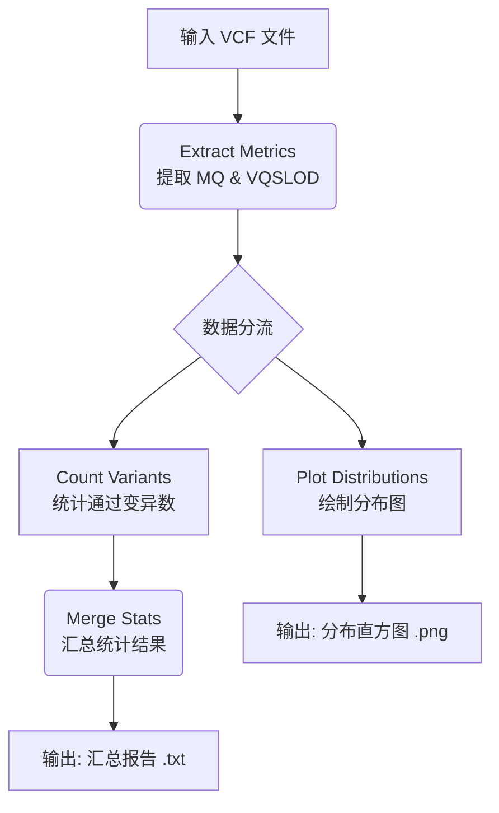

# 变异位点质量控制与统计分析流程 (Variant QC & Statistics Pipeline)

## 项目简介
本项目旨在对全基因组测序 (WGS) 或全外显子组测序 (WES) 的变异检测结果 (VCF) 进行质量控制 (QC) 和统计分析。主要关注两个关键的质量指标：**Mapping Quality (MQ)** 和 **VQSLOD**。

通过 Nextflow 流程，自动化地从 VCF 文件中提取这些指标，生成分布图，并根据预设阈值统计通过过滤的变异数量。

## 流程架构
该流程基于 Nextflow 编写，包含以下四个主要步骤：

1.  **指标提取 (Extract Metrics)**: 使用 `bcftools` 从 VCF 文件中提取 MQ 和 VQSLOD 值。
2.  **分布绘图 (Plot Distributions)**: 绘制各染色体的 MQ 和 VQSLOD 分布直方图，直观展示数据质量。
3.  **变异统计 (Count Variants)**: 根据设定的阈值（MQ > 58.75, VQSLOD > 10），统计通过过滤的变异数量。
4.  **结果汇总 (Merge Stats)**: 将所有染色体的统计结果合并为一份总报告。

### 流程图



## 可配置参数
您可以在运行 Nextflow 时通过命令行参数覆盖默认设置，或直接修改 `tuning.variants.v5.nf` 文件。

| 参数名 | 默认值 | 说明 | 命令行示例 |
| :--- | :--- | :--- | :--- |
| `MQThreshold` | 58.75 | Mapping Quality 过滤阈值 (>) | `--MQThreshold 60.0` |
| `VQSLODThreshold` | 10.0 | VQSLOD 过滤阈值 (>) | `--VQSLODThreshold 8.0` |
| `VcfPath` | (脚本内定义) | 输入 VCF 文件的目录路径 | `--VcfPath /path/to/vcf` |
| `OutDir` | (脚本内定义) | 结果输出目录 | `--OutDir ./my_results` |

**运行示例：**

```bash
nextflow run tuning.variants.v5.nf --MQThreshold 60.0 --VQSLODThreshold 9.5
```

## 脚本功能说明

### 1. `extract_metrics.py`
*   **功能**: 调用 `bcftools query` 快速提取指定字段。
*   **特点**: 
    *   使用流式处理 (Streaming)，内存占用极低。
    *   支持多线程解压。
    *   输出为 TSV 格式 (`MQ\tVQSLOD`)。

### 2. `plot_distributions.py`
*   **功能**: 生成高质量的分布直方图。
*   **特点**:
    *   使用 `numpy` 进行分块读取 (Chunked Reading)，支持处理数千万行的大文件。
    *   自动过滤 `inf`/`nan` 等无效值。
    *   在图中标记阈值线和通过区域。
    *   处理多值字段（取最大值）。

### 3. `count_variants.py`
*   **功能**: 精确统计通过过滤的变异数。
*   **特点**:
    *   **高精度计算**: 使用 `float64` 避免浮点数误差。
    *   **健壮性**: 能够处理多值字段（如 `.,60`）和异常值，确保与 `bcftools` 逻辑一致。
    *   **统计指标**:
        *   `Total_Raw`: 原始变异总数
        *   `Invalid`: 无效值（解析失败或 NaN）
        *   `MQ_Pass`: MQ > 阈值
        *   `VQSLOD_Pass`: VQSLOD > 阈值
        *   `Both_Pass`: 同时满足两个条件

### 4. `merge_stats.py`
*   **功能**: 汇总所有染色体的统计数据。
*   **特点**:
    *   生成包含详细百分比的汇总表格。
    *   自动计算全基因组层面的总通过率。

## 运行环境
*   **Nextflow**: 流程管理
*   **Python 3**: 数据处理
    *   依赖库: `numpy`, `matplotlib`
*   **Bcftools**: VCF 操作
*   **Slurm**: 作业调度 (配置在 `nextflow.config` 中)

## 结果解读
最终生成的 `all_chromosomes_summary.txt` 包含以下关键信息：
*   **Total_Raw**: 变异总数，应与 VCF 行数一致。
*   **Both_Pass_Pct**: 最终通过率，反映了在该阈值组合下保留的高质量变异比例。

## 注意事项
*   **多值字段**: 脚本逻辑已调整为取多值字段中的**最大值**进行判断，以匹配 `bcftools` 的过滤逻辑。
*   **精度**: 所有计算均采用双精度浮点数 (`float64`)，确保边界值判断准确。
